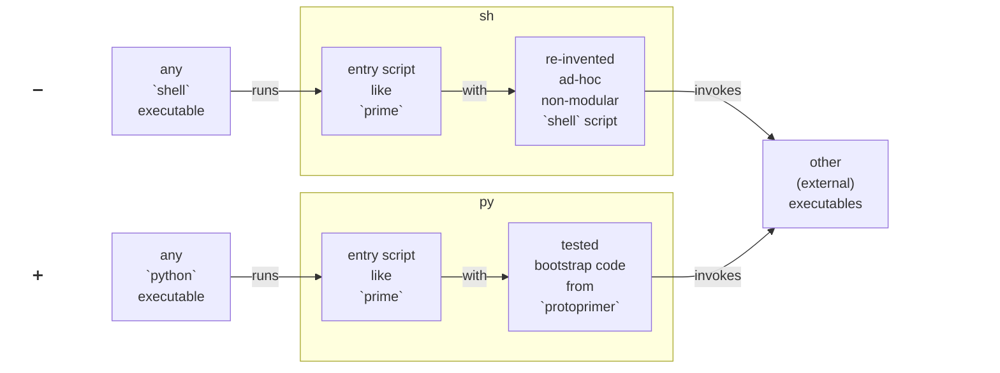

# Background

```{contents}
:local:
:depth: 2
```

<a id="protoprimer-motivation"></a>

## First: why avoid `shell`?

Main reason:
> Your org **does not test** `shell` scripts.

<details id="shell-issues">
<summary>Let's expand:</summary>

The `shell` paradox:
> We start with `shell` because it is "simple" to start, but that is also `shell`:

*   ❌ (unit) test code for `shell` scripts is close to none
*   ❌ no default error detection - forget `set -e` and "everything is fine"
*   ❌ cryptic "write-only" syntax - `echo "${file_path##*/}"` vs `os.path.basename(file_path)`
*   ❌ subtle, error-prone pitfalls, `shopt` nuances
*   ❌ unpredictable local/user overrides - `PATH` pointing to unexpected binaries
*   ❌ deceptively cross-platform even on *nixes - divergent behaviors: macOS vs Linux
*   ❌ no stack traces on failure - instead, noisy and excessive logging
*   ❌ limited native data structures, no nested ones
*   ❌ no modularity - code larger than one-page-one-file is cumbersome
*   ❌ no external libraries/packages, no enforce-able dependencies
*   ❌ inter-depend for reuse by `source`-ing - an entangled mess
*   ❌ being so unpredictable makes `shell` scripts high security risks
*   ❌ slow
*   ...

</details>

In short, `shell` is a very poor language choice for evolving software.

<details>
<summary>What if we automated with <code>python</code> instead?</summary>

*   **Ubiquity**: shares the same "pre-installed-anywhere" scripting niche (as `shell`).
*   **Mindshare**: leverages the vast ecosystem everyone is exposed to (as `shell`).
*   **Sanity**: testable, structured code with a clear syntax (**not** as `shell`).

</details>

### Problem: you do not simply avoid `shell`

Every time some `repo.git` is cloned, it has to be prepared to be useful.

Because `python` is **not** ready, `shell` is used (again!) to make it ready.

<div style="text-align:center;">
    <a href="https://www.youtube.com/shorts/gNYgeAxCK3M">
        
    </a>
</div>

Ultimately, why not use `python` to unwrap itself?

### Solution: immediately runnable `python`

Eliminate dependency on `shell`:

<ul style="list-style: none; padding-left: 0 !important;">
<li>➖ instead of relying on a <code>shell</code> executable to bootstrap <code>python</code></li>
<li>➕ rely on a <code>python</code> executable (any version) to bootstrap <code>python</code> (required version)</li>
</ul>

An app started via `protoprimer` switches to `venv` - no (explicit) `activate`-tion needed:

```sh
./hello_world
```

See the difference:



## Last: why not `uv`?

Make no mistake: `protoprimer` relies on `uv` (optionally).

It starts as a `python` script, then bootstraps `uv`, and only then runs `uv`.

### Problem: lazy audience

Distinguish these:
*   **dev-authors**: know the tools in use (like `uv`), but do not like **writing manuals**
*   **dev-users**: may not know the tools and the repo, but do not like **reading manuals**
*   **end-users**: ...

You want to:
*   free **dev-authors** from support
*   reduce the entry barrier for **dev-users**

<details>
<summary><code>uv</code> is hardly <strong>arg-less</strong> and <strong>single-touch</strong> without a <code>shell</code> wrapper:</summary>

*   Its binary has to be prepared. A `shell` wrapper?
*   Its args have to be provided. A `shell` wrapper?
*   Project-specific steps require more than `uv`. A `shell` wrapper?

Re-inventing such wrappers for every project is not optimal.

</details>

Relying on `python` first:
*   is more robust for the **single-touch** bootstrap (`python` is more ubiquitous than `uv`)
*   uses **easily modifiable** `python` text code to wrap calls to any binary (like `uv`)

### Solution: wrap details

Feel the difference:

| `protoprimer` | `uv`                                  |
|---------------|---------------------------------------|
| `./bootstrap` | `uv run python -m module_a.bootstrap` |
| `./app_1`     | `uv run python -m module_b.app_1`     |
| `./app_2`     | `uv run python -m module_c.app_2`     |
