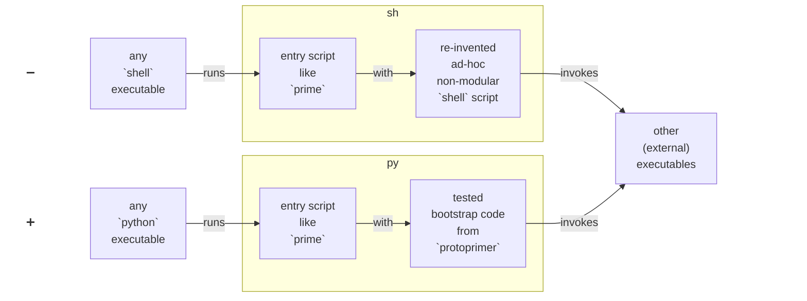

```{eval-rst}
.. meta::
   :description: Why `protoprimer` exists: avoiding `shell` scripts, bootstrapping `python` with `python`, and wrapping `uv`
   :keywords: background, rationale, shell, python, uv, bootstrap
```

# Background

```{contents}
:local:
:depth: 2
```

## First: repo bootstrap

Distributing software via repo clones has its benefits:
*   instant updates in both directions (push or pull)
*   comprehensive LLM support

<details>
<summary>Useful requirements to make code runnable automatically:</summary>

*   Bootstrap in a **single** step on repo clone (update on repo pull).
*   Assume **zero** user preparations.
*   Make the setup depend on the target **environment**.
*   Support **flexible** directory layouts to discover repo configs.
*   **Isolate** runtime per repo clone to allow co-existing versions.

</details>

### Problem: avoid reinventing the wheel

But how do we reuse it without making the user install it first?

### Solution: host a copy

The entire `protoprimer` code (its auto-update-able copy) is committed to the user repo.

## Next: why avoid `shell`?

Main reason:
> Your org **does not test** `shell` scripts.

<details>
<summary>Let's expand:</summary>

The `shell` paradox:

> We start with `shell` because it is "simple" to start.
>
> But `shell` is also all of these:

*   ❌ (unit) test code for `shell` scripts is next to none
*   ❌ no default error detection - forget `set -e` and "everything is fine"
*   ❌ cryptic "write-only" syntax - `echo "${file_path##*/}"` vs `os.path.basename(file_path)`
*   ❌ subtle, error-prone pitfalls, `shopt` nuances
*   ❌ unpredictable local/user overrides - `PATH` pointing to unexpected binaries
*   ❌ deceptively cross-platform even on *nixes - divergent behaviors: macOS vs Linux
*   ❌ no stack traces on failure - instead, noisy and excessive logging
*   ❌ limited native data structures, no nested ones
*   ❌ no modularity - code larger than one-page-one-file is cumbersome
*   ❌ no external libraries/packages, no enforceable dependencies
*   ❌ interdependency via `source`-ing - an entangled mess
*   ❌ being so unpredictable makes `shell` scripts a high security risk
*   ❌ slow
*   ...

</details>

In short, `shell` is a very poor language choice for evolving software.

<details>
<summary>What if we automated with <code>python</code> instead?</summary>

*   **Ubiquity**: shares the same "pre-installed-anywhere" scripting niche (as `shell`).
*   **Mindshare**: leverages the vast ecosystem everyone is exposed to (as `shell`).
*   **Sanity**: testable, structured code with a clear syntax (**not** as `shell`).

</details>

### Problem: who bootstraps the bootstrapper?

Every time some `repo.git` is cloned, it has to be prepared before it can be useful.

Because `python` is **not** ready, `shell` is used (again!) to make it ready.

<div style="text-align:center;">
    <a href="https://www.youtube.com/shorts/gNYgeAxCK3M">
        
    </a>
</div>

Ultimately, why not use `python` to unwrap itself?

### Solution: immediately runnable `python`

Eliminate dependency on `shell`:

<ul style="list-style: none; padding-left: 0 !important;">
<li>➖ instead of relying on a <code>shell</code> executable to bootstrap <code>python</code></li>
<li>➕ rely on a <code>python</code> executable (any version) to bootstrap <code>python</code> (required version)</li>
</ul>

An app started via `protoprimer` switches to `venv` - no (explicit) `activate` needed:

```sh
./hello_world
```

See the difference:


```mermaid
flowchart LR;
    heavy_minus["➖"];
    shell_exec["any<br>`shell`<br>executable"];
    subgraph "sh"
        sh_entry_script["entry script<br>like<br>`prime`"];
        embedded_code["re-invented<br>ad-hoc<br>non-modular<br>`shell` script"];
    end

    heavy_plus["➕"];
    python_exec["any<br>`python`<br>executable"];
    subgraph "py"
        py_entry_script["entry script<br>like<br>`prime`"];
        py_bootstrap_code["tested<br>bootstrap code<br>from<br>`protoprimer`"];
    end

    external_exec["other<br>(external)<br>executables"];

    invis_block[ ];

    heavy_minus ~~~ shell_exec;
    shell_exec --runs--> sh_entry_script;
    sh_entry_script --with--> embedded_code;

    heavy_plus ~~~ python_exec;
    python_exec --runs--> py_entry_script;
    py_entry_script --with--> py_bootstrap_code;

    embedded_code --invokes--> external_exec;
    py_bootstrap_code --invokes--> external_exec;

    external_exec ~~~ invis_block;

    style heavy_minus fill:none,stroke:none;
    style heavy_plus fill:none,stroke:none;

    style invis_block fill:none,stroke:none;
```

Looks identical, yet `protoprimer` **pins** and **isolates**, while `shell` does **not**.

## Last: why not `uv`?

Make no mistake: `protoprimer` (optionally) relies on `uv`.

The `python` script bootstraps `uv`, then runs `uv`.

### Problem: need a wrapper

`uv` is hardly **arg-less** and **single-touch** without a wrapper script:

*   Its binary has to be prepared.
*   Its args have to be provided.
*   Project-specific steps require more than `uv`.

### Solution: have a wrapper

Feel the difference:

| `protoprimer` | `uv`                                  |
|---------------|---------------------------------------|
| `./bootstrap` | `uv run python -m module_a.bootstrap` |
| `./app_1`     | `uv run python -m module_b.app_1`     |
| `./app_2`     | `uv run python -m module_c.app_2`     |

Relying on `python` first:
*   is more robust for the **single-touch** bootstrap (`python` is more ubiquitous than `uv`)
*   uses **easily modifiable** `python` text code to wrap calls to any binary (like `uv`)
