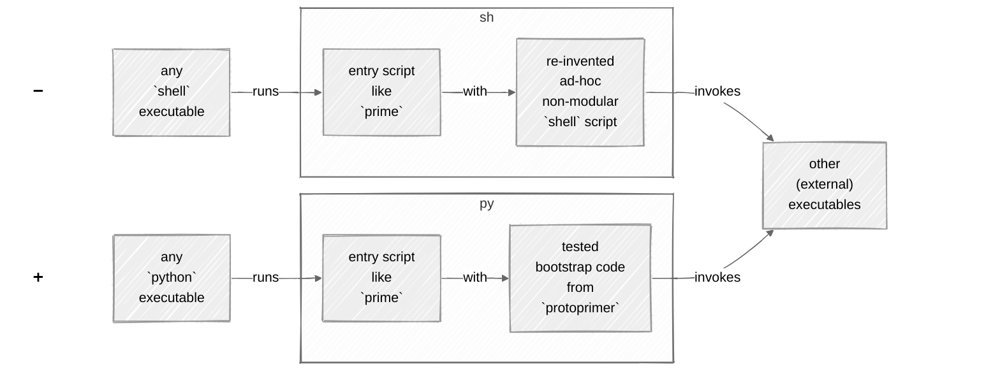

<!--

TODO: Save it somewhere.
This is an old `protoprimer` used in the main `readme.md` before the intro on https://protoprimer.readthedocs.io/

-->

# [`protoprimer`][protoprimer_readthedocs]

Want your users to run software straight from a `git` repo with a single, zero-argument, healing command?

```sh
./prime
```

*   No conflicts: everything is isolated to that repo clone.
*   No bloat: no automatic changes to global, local, user configs (e.g. no `~/.*rc` updates, etc.).
*   Reversible: simply remove the repo clone.

<details>
<summary><code>protoprimer</code> is the bootstrapper that eliminates the growth of fragile <code>shell</code> scripts:</summary>

<br>

*   not a binary but **a text** - a transparent, standalone `python` script that lives inside your repo
*   starts with **"wild"** `python` - hands over with required `python` in an isolated `venv` with pinned dependencies
*   handles multiple target environments with basic configs to take off in different directions
*   an extensible bootstrap DAG to handle it all **in one shot**
*   a universal main-function starter **without** explicit `venv` **activation**

</details>

<a id="protoprimer-motivation"></a>

## First: why avoid `shell`?

Main reason:\
Your org **does not test** `shell` scripts.

<details id="shell-issues">
<summary>Let's expand:</summary>

<br>

The `shell` paradox:\
we start with `shell` because it is "simple", but that is also `shell`:

*   :x: (unit) test code for `shell` scripts is close to none
*   :x: no default error detection (forget `set -e` and an undetected disaster bubbles through the call stack)
*   :x: cryptic "write-only" syntax (e.g. `echo "${file_path##*/}"` vs `os.path.basename(file_path)`)
*   :x: subtle, error-prone pitfalls (e.g. `shopt` nuances)
*   :x: unpredictable local/user overrides (e.g. `PATH` points to unexpected binaries)
*   :x: less cross-platform than it seems even on *nixes (e.g. divergent command behaviors: macOS vs Linux)
*   :x: no stack traces on failure (which encourages noisy, excessive logging instead)
*   :x: limited native data structures (no nested ones)
*   :x: no modularity (code larger than one-page-one-file is cumbersome)
*   :x: no external libraries/packages (no enforce-able dependencies)
*   :x: when `shell` scripts multiply, they inter-depend for reuse (by `source`-ing) into an entangled mess
*   :x: being so unpredictable makes `shell` scripts high security risks
*   :x: slow
*   ...

</details>

In short, `shell` is a very poor language choice for evolving software.

<details>
<summary>What if we automated with <code>python</code> instead?</summary>

<br>

*   **Ubiquity**: shares the same "pre-installed-anywhere" scripting niche (as `shell`).
*   **Mindshare**: leverages a massive community and vast ecosystem everyone is exposed to (as `shell`).
*   **Sanity**: testable, structured code with a clear syntax.

</details>

### Problem 1: one does not simply avoid `shell`

Every time some `repo.git` is cloned,
it has to be prepared/bootstrapped/primed to make many things ready.

Because `python` is **not** ready yet,\
people resort to `shell` scripts (again!) to make it ready.

<div style="text-align:center;">
    <a href="https://www.youtube.com/shorts/gNYgeAxCK3M">
        
    </a>
</div>

<br>

Ultimately, why not use `python` to take care of itself?

### Solution 1: immediately runnable `python`

Eliminate dependency on `shell`:\
➖ instead of relying on the presence of a `shell` executable to bootstrap `python`\
➕ rely on a `python` executable (of any version) to bootstrap the required `python` version

An app started via `protoprimer` switches to `venv` - no (explicit) `activate`-tion needed:

```sh
./hello_world
```

See the difference:



## Next: why not `uv`?

In fact, `protoprimer` relies on `uv` (optionally).\
But, it starts as a `python` script (then bootstraps `uv` and runs `uv`).

### Problem 2: audience

Distinguish these:
*   **dev-authors**: deeply understand the tools in use (like `uv` or anything else), do not like writing manuals
*   **dev-users**: strangers to the repo, new to the `python` ecosystem, but can contribute and improve some stuff
*   **end-users**: ...

<details>
<summary>You do not want to obstruct experienced <strong>dev-authors</strong>, but you want <strong>dev-users</strong> to start fast:</summary>

<br>

Relying on `python` first:
*   is more robust for the **single-touch** bootstrap (`python` is more ubiquitous than `uv`)
*   uses **easily modifiable** local _interpreted_ `python` code to wrap calls to any _compiled_ binary (like `uv`)

In short, `uv` is one of many other executables (external to `python`) employable for bootstrapping.

Also, `uv` is hardly **arg-less** and **single-touch** without a `shell` wrapper:
*   Its binary has to be prepared. A `shell` wrapper?
*   Its args have to be provided. A `shell` wrapper?
*   Full bootstrap requires a few `uv` invocations. A `shell` wrapper?
*   Project-specific steps require more than `uv`. A `shell` wrapper?
*   Users want these details hidden. A `shell` wrapper?

It is **not** ideal to re-invent such wrappers for every project.

</details>

### Solution 2: wrap details

Feel the difference:

| `protoprimer` | `uv`                                  |
|---------------|---------------------------------------|
| `./bootstrap` | `uv run python -m module_a.bootstrap` |
| `./app_1`     | `uv run python -m module_b.app_1`     |
| `./app_2`     | `uv run python -m module_c.app_2`     |

<a id="protoprimer-extensions"></a>

## Last: adaptive bootstrapping

Think:
*   generating code
*   downloading data
*   ensuring security keys
*   configuring pre-commit hooks & linters
*   ...

`protoprimer` acts as a "seed" to grow via an extensible bootstrap (DAG or handover).

Different env? Different direction:
*   local **or** cloud
*   Alice **or** Bob
*   dev **or** prod
*   v1 **or** v2
*   ...

## Bonus: the springboard for any toolchain

`python` is **omnipresent**.

<details>
<summary>In principle, achieving single-touch <strong>requires omnipresence</strong>:</summary>

<br>

The bootstrap code can **only rely on very basic** pre-requisites satisfiable by default.

The availability of `python` is more reliable than "universal" `shell` compatibility:
*   old `bash` 3.x and `zsh` differences on macOS
*   non-POSIX "shells" on Windows
*   ...

Why is `python` the ultimate seed?
*   if not available, trivially installed
*   arguably, new `python` devs write less error-prone "Day 0" code than old `shell` devs
*   no compiler stage - it executes "committable text" directly without invoking build tools (just like `shell`)
*   solves most of the "Why avoid `shell`?" problems ([see above][shell_issues])

</details>

In turn, once bootstrapped, `python` code may springboard other toolchains:
*   `java`
*   `js`
*   `go`
*   ...

---

[readme.md]: ../../readme.md

[protoprimer_readthedocs]: https://protoprimer.readthedocs.io/

[pyapp_project]: https://github.com/ofek/pyapp

[local_proto_kernel.py]: ../../cmd/proto_code/proto_kernel.py
[local_primer_kernel.py]: ../../src/protoprimer/main/protoprimer/primer_kernel.py

[local_prime]: ../../prime

[local_doc]: ../../src/local_doc
[local_repo]: ../../src/local_repo
[local_test]: ../../src/local_test
[protoprimer]: ../../src/protoprimer
[metaprimer]: ../../src/metaprimer

[src_dir]: ../../src
[cmd_dir]: ../../cmd

[FT_90_65_67_62.proto_code.md]: ../../doc/feature_topic/FT_90_65_67_62.proto_code.md
[FT_75_87_82_46.entry_script.md]: ../../doc/feature_topic/FT_75_87_82_46.entry_script.md
[FT_57_87_94_94.bootstrap_process.md]: ../../doc/feature_topic/FT_57_87_94_94.bootstrap_process.md

[SOLID_wiki]: https://en.wikipedia.org/wiki/SOLID
[DAG_wiki]: https://en.wikipedia.org/wiki/Directed_acyclic_graph
[make_wiki]: https://en.wikipedia.org/wiki/Make_(software)
[systemd_wiki]: https://en.wikipedia.org/wiki/Systemd

[constraints.txt]: dst/default_env/constraints.txt
[pyproject.toml]: src/metaprimer/pyproject.toml

[protoprimer_extensions]: #protoprimer-extensions
[protoprimer_motivation]: #protoprimer-motivation

<!-- markdownlint-disable MD051 -->
<!--
NOTE: This "user-content-" prefix is added by github.com when it renders the Markdown into HTML.
-->
[shell_issues]: #user-content-shell-issues
<!-- markdownlint-enable -->
