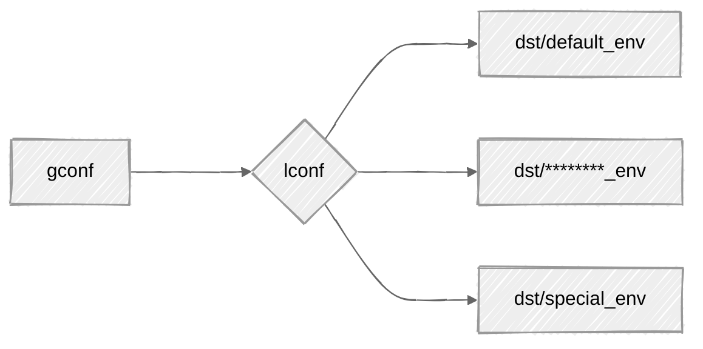

## Configuration: global vs local

`protoprimer` supports:
*   `gconf` ~ global config: shared between all environments (repo clones)
*   `lconf` ~ local config: private to specific environments (repo clones)



For example, this repo has:

| sample paths                | track changes |                                                          |
|-----------------------------|---------------|----------------------------------------------------------|
| `gconf/*`                   | yes           | dir with global config                                   |
| `lconf -> dst/default_env/` | **no**        | dir with selected local config (symlink to specific env) |
| `dst/*/*`                   | yes           | config dirs for different envs (`lconf` symlink targets) |

To bootstrap in any other (non-default) env, run:

```sh
./prime --env dst/special_env
```

The existence of `lconf` symlink (and where it points to)
is private to the repo clone (and should be `.gitignore`-ed)
but all its possible targets in `dst/*` have to be versioned.

## Relation to config layout

In the context of `protoprimer`,
there are two distinct configurations closely related to [FT_89_41_35_82.conf_leap.md][FT_89_41_35_82.conf_leap.md]:

*   `source_global` configuration is stored in a config file common to all deployment (related to `leap_client`).

*   `source_local` configuration is stored in environment files (related to `leap_env`).

## Config overrides

This config data is special because `source_global` and `source_local` has many common fields.

There are simple/limited and complex/flexible approaches to "merging" the two data sources:
1.  for primitive field values, overriding is a straight-forward (almost universal) strategy
2.  for nested field values (e.g. `list` or `dict`), there can be multiple ways (override, merge, etc.)

The 1st approach is used for the common fields
where values from `source_local` take precedence over values from `source_global`.

The 2nd approach is used by [FT_00_22_19_59.derived_config.md][FT_00_22_19_59.derived_config.md].

---

[FT_02_89_37_65.shebang_line.md]: FT_02_89_37_65.shebang_line.md
[FT_89_41_35_82.conf_leap.md]: FT_89_41_35_82.conf_leap.md
[FT_00_22_19_59.derived_config.md]: FT_00_22_19_59.derived_config.md
