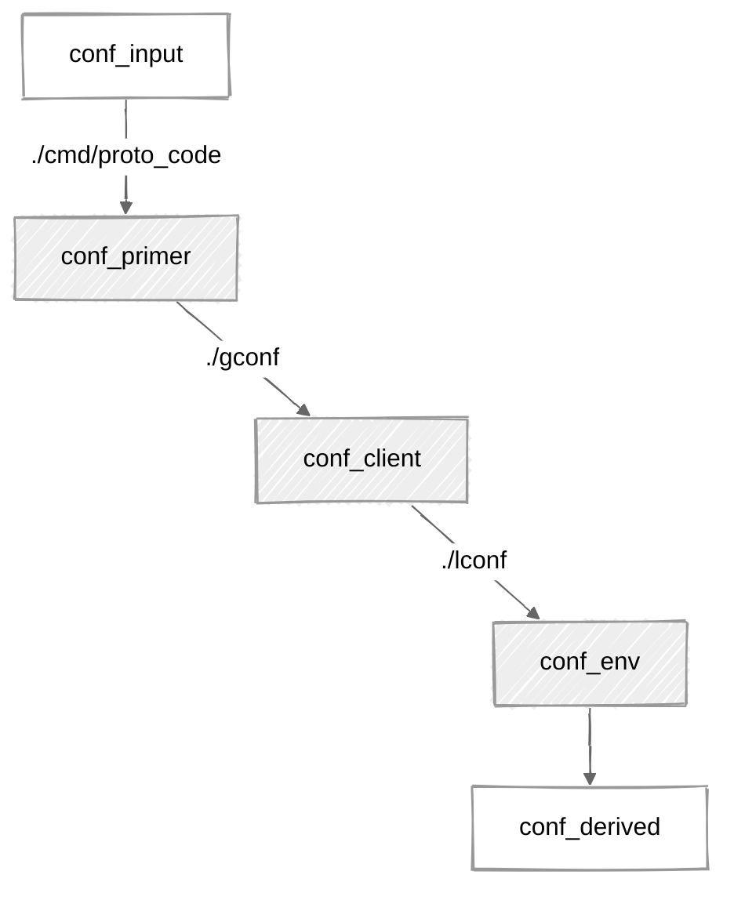

## Intro

There are several configuration leaps used by [FT_90_65_67_62.proto_code.md][FT_90_65_67_62.proto_code.md].

Essentially, going through all the conf leaps is the way to load all the config info.

## Filesystem layout: configuration leaps

`protoprimer` supports any filesystem layout for client repos.

To discover the config files within the filesystem, it uses the concept of "config leap" - see:

```
./prime config
```



*   `leap_input`: not a file - represents data available to the process (env vars, CLI args, etc.)
*   [`leap_primer`][leap_primer]: allows "proto code" to find the client repo "global config"
*   [`leap_client`][leap_client]: provides "global config" and allows finding the target env "local config"
*   [`leap_env`][leap_env]: provides "local config"
*   `leap_derived`: not a file - represents effective config data derived from all the other data

## Ordering

Information from the prev leap specifies how to find the next one.

Configuration leaps are ordered (from first to last).

*   `leap_input`

    This info is provided before path to the file with `proto_conf` is found.

    It may only from command line args, env vars, or hard-coded values.

    See [FT_02_89_37_65.shebang_line.md][FT_02_89_37_65.shebang_line.md].

*   `leap_primer`

    This is provided by `proto_conf`.

*   `leap_client`

    This leap provides client-specific configurations.

*   `leap_env`

    This leap provides environment-specific configurations.

    It only makes sense to distinguish `leap_env` from `leap_client` when there are more than one environment
    client code needs to deal with.

    This is also the leap that gives access to `source_local` config.
    See also [FT_23_37_64_44.global_vs_local.md][FT_23_37_64_44.global_vs_local.md].

*   `leap_derived`

    This is effective configuration that applies overrides of `leap_client` field values by `leap_env` ones.

    See [FT_00_22_19_59.derived_config.md][FT_00_22_19_59.derived_config.md].

## Configuration files

Depending on the [FT_59_95_81_63.env_layout.md][FT_59_95_81_63.env_layout.md], all configuration leaps
may be provided in a single file or separate ones.

[leap_primer]: cmd/proto_code/proto_kernel.json
[leap_client]: gconf/proto_kernel.json
[leap_env]: dst/default_env/proto_kernel.json

[FT_63_61_24_94.protoprimer_dictionary.md]: FT_63_61_24_94.protoprimer_dictionary.md
[FT_90_65_67_62.proto_code.md]: FT_90_65_67_62.proto_code.md
[FT_75_87_82_46.entry_script.md]: FT_75_87_82_46.entry_script.md
[FT_59_95_81_63.env_layout.md]: FT_59_95_81_63.env_layout.md
[FT_02_89_37_65.shebang_line.md]: FT_02_89_37_65.shebang_line.md
[FT_23_37_64_44.global_vs_local.md]: FT_23_37_64_44.global_vs_local.md
[FT_00_22_19_59.derived_config.md]: FT_00_22_19_59.derived_config.md
