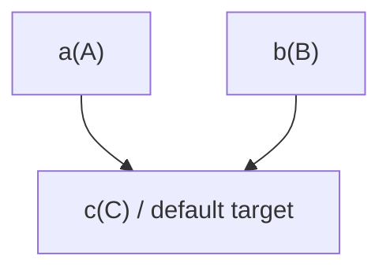
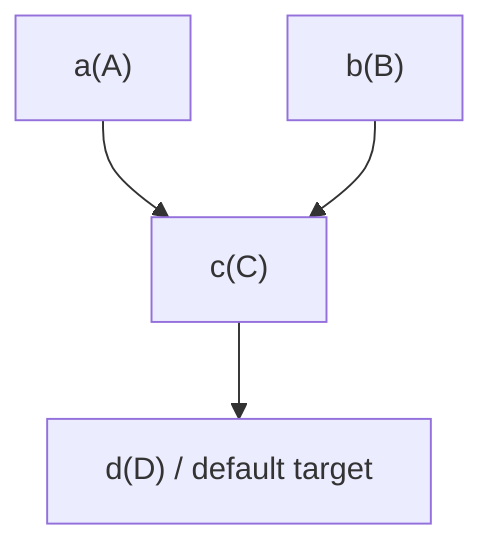
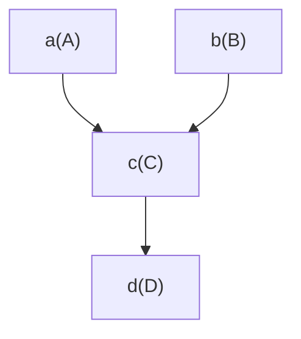
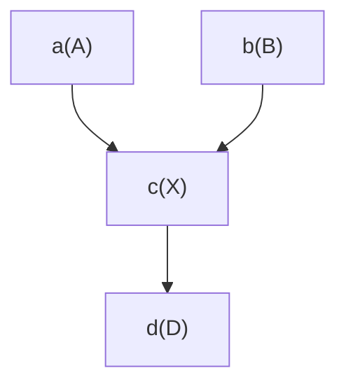

## Intro

This doc shows examples how default state DAG can be extended.

It uses:
*   Lowercase letters (e.g.) `a` are used for state names.
*   Uppercase letters (e.g.) `A` are used for class implementing the state.

Normally, they are closely related (e.g. `a` ~ `A`)
because states have their meaning and that implies specific dependencies.
In other words:
*   implementation `A` of state `a` assumes it implements nothing else but `a` and depends on states `b`, `c`, ...
*   implementation `Z` of state `z` assumes it implements nothing else but `z` and depends on states `x`, `y`, ...

But it is not always the case.
For example, see below (replace by new and use old)

## Case: trivial extend only

Let's say state `c` implemented by class `C` is the default target:

Extend it by state `d` implemented by class `D` and make `d` the default target:

## Case: replace only

Let's say state `c` implemented by class `C` has to be replaced:

Instead, `c` has to be implemented by class `X`:

## Other cases

*   [UC_27_40_17_59.replace_by_new_and_use_old.md][UC_27_40_17_59.replace_by_new_and_use_old.md]

---

[UC_27_40_17_59.replace_by_new_and_use_old.md]: UC_27_40_17_59.replace_by_new_and_use_old.md
