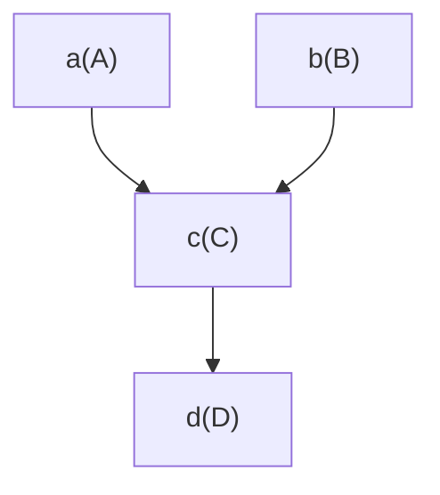
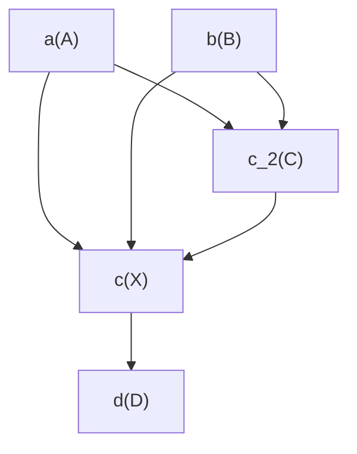

## Case: replace by new and use old

In this case we want to use both old and new implementations
(e.g., the new implementation makes use of the old implementation).

Let's start with this diagram:

Imagine, state `c` has to be implemented by class `X` but class `X` still wants to use class `C` somehow.

In that case:
*   add another state name (e.g.) `c_2`
*   implement that state `c_2` by class `C` (which will still depend on `a` and `b`)
*   make `c` implemented by `X` depend on `c_2` to use implementation `C`

