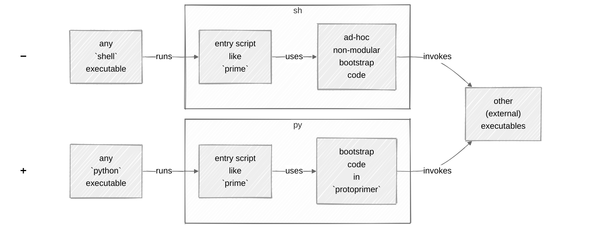
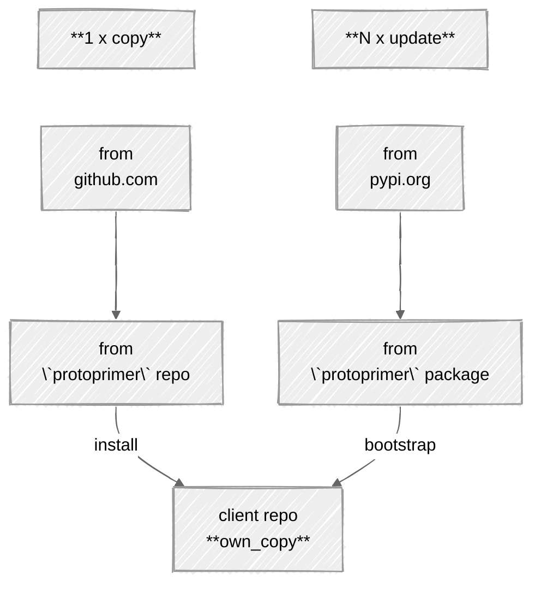
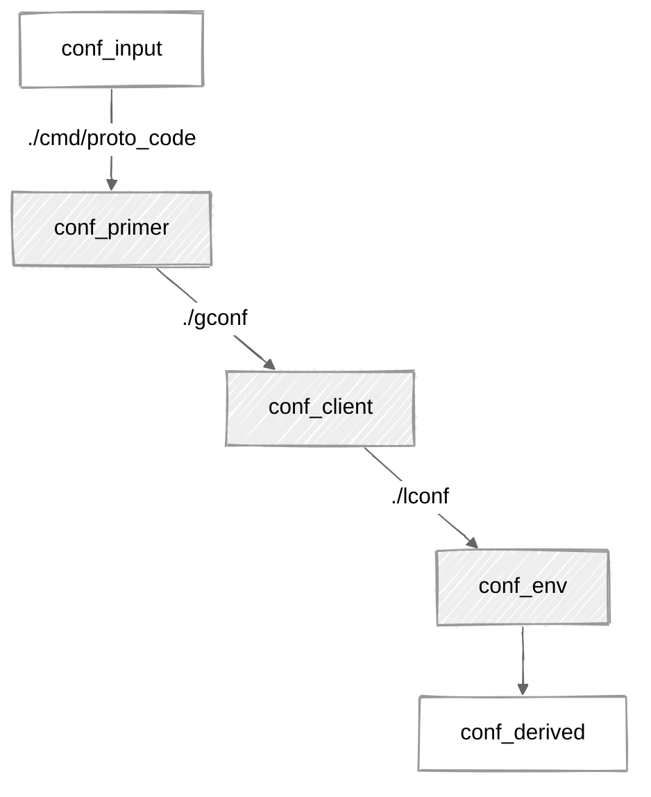

[](https://pypi.org/project/protoprimer)
[](https://github.com/uvsmtid/protoprimer/actions/workflows/test_3.7.yaml)
[](https://github.com/uvsmtid/protoprimer/actions/workflows/test_3.14.yaml)
[](https://github.com/uvsmtid/protoprimer/actions/workflows/lint.yaml)
[](https://github.com/uvsmtid/protoprimer/actions/workflows/doc.yaml)
[](https://coveralls.io/github/uvsmtid/protoprimer)
<!--
FT_84_11_73_28: see supported python versions above.

TODO: Use links to FC/UC docs under `./doc` (when ready) from this readme to navigate to details.
-->

# `protoprimer`

<!--
TODO: Change to `env bootstrapper` and `app starter`.
-->

*   An **app** to bootstrap (not only) `python` projects in a single click (from fresh repo clone).
*   A **lib** to switch `python` runtime into `venv` directly (avoiding intermediate `shell` wrappers).

## Introduction

### The Problem

Every time a `python` repository is cloned, it must be prepared, bootstrapped, or "primed" before you can do any real work. Because the required `python` version and dependencies are not yet available, this initial setup often falls back to shell scripts. This creates a cycle where `python` projects, meant to be automated with `python`, still rely on shell for the very first step.

<p align="center">
  <a href="https://www.youtube.com/shorts/gNYgeAxCK3M">
    
  </a>
</p>

Can we escape this cycle and use `python` to bootstrap `python`?

### The Solution

The `protoprimer` replaces the initial shell script with a single, self-contained `python` script. This script can be run by **any** `python` interpreter available on the system. It then handles the complex process of bootstrapping the **required** `python` version and environment for your project.



The approach is to wrap all the bootstrapping complexity into a **single-touch** command that "just works" with minimal prerequisites.

## Getting Started

For the simplest case, see [instant_python_bootstrap][instant_python_bootstrap].

### 1. Get your copy

The `protoprimer` is not installed as a package initially (to avoid a "chicken and egg" problem). Instead, you add a standalone script to your repository.

Get your copy of `proto_kernel.py` and save it as `prime` in your project root:
```sh
git fetch --depth 1 https://github.com/uvsmtid/protoprimer main
git show FETCH_HEAD:cmd/proto_code/proto_kernel.py > prime
chmod u+x prime
```
Feel free to rename `prime` or move it elsewhere in your repository.

### 2. Commit it

Commit your copy of the script so it's available to everyone who clones the repo.
```sh
git add prime
git commit -m 'Add protoprimer bootstrap script'
```

### 3. Run it

Now, anyone can bootstrap the project environment with a single command:
```sh
./prime
```
This command will switch to the required `python` version, create a `venv`, and install all necessary dependencies, specific to the environment (dev, prod, etc.).

## Typical Usage

Bootstrap the default environment:
```sh
./prime
```

Bootstrap a special environment:
```sh
./prime --env dst/special_env
```

Upgrade dependencies and re-create the `venv`:
```sh
./prime upgrade
```

Review the effective configuration:
```sh
./prime config
```

<!--
TODO: Demo `app_starter` via venv and via entry script.
-->

## How It Works

### The Stand-alone "Proto Code"

The script you copied (`prime` in the example) is the **"proto code"**. It's a self-contained copy of [`proto_kernel.py`][local_proto_kernel.py] from this repository. You only need one copy per repository.

This proto code is distinct from an **"entry script"**. An entry script is any script that uses the proto code to run. Your repository can have many entry scripts for different tasks, all leveraging the same central proto code. In this repo, `./prime` is an entry script that uses the proto code at `./cmd/proto_code/proto_kernel.py`.

The proto code is designed to solve the "chicken & egg" problem: you can't install a package from `pip` without a `python` environment, but you need the package to set up the environment. The standalone script runs first, sets up the `venv`, and *then* it can install the full `protoprimer` package and even auto-update itself.



### The Bootstrap Process

The primary feature of `protoprimer` is to handle the tedious early steps of bootstrapping:
1.  **Python Version Switching**: The proto code starts with any available `python`. Based on your project's configuration, it finds and switches to the required `python` version using `os.execve`. You can see this by running `./prime -v`.
2.  **Reproducible `venv`**: It creates a `venv` and uses a lockfile (`constraints.txt`) to install the exact versions of your dependencies specified in `pyproject.toml`, ensuring a reproducible environment.
3.  **Upgrading**: Running `./prime upgrade` will re-create the `venv`, re-solve dependencies, and update your `constraints.txt` lockfile.
4.  **Delegation**: The bootstrap process is an extensible [DAG][DAG_wiki]. After the environment is ready, `protoprimer` passes control to your own client-specific code to run further setup steps.

<!--
TODO: To support Windows, `os.execve` will have to be changed to use `subprocess` with a chain of children.
-->
<!--
TODO: UC_52_87_82_92.conditional_auto_update.md: update when disabling auto-update is possible.
-->

### Configuration

`protoprimer` uses a layered configuration system that is discovered through a series of "leaps" across your filesystem. You can see the final result by running `./prime config`.

*   **Global vs. Local**: It separates shared, repository-wide configuration (`gconf`) from environment-specific local configuration (`lconf`). This allows developers to have their own local setup without affecting the shared configuration.
*   **Filesystem Layout**: The "config leap" mechanism allows `protoprimer` to find configuration files regardless of your repository's structure.


Each layer can override settings from the previous one, providing a flexible way to manage configuration.

<!--
## How to extend and customize it?

TODO: FT_93_57_03_75.app_vs_lib.md: Explain examples `./cmd/env_bootstrapper` and `./cmd/app_starter`

-->

<details>
<summary><h2>Design Rationale</h2></summary>

### Why `proto*`?

`proto` = early, when nothing exists yet. The `protoprimer` is designed to work with minimal pre-conditions: no pre-installed dependencies, no pre-initialized `venv`, not even the required `python` version in `PATH`. Just a naked `python` interpreter and the standalone proto code script.

### Why not `uv`?

Yes, `protoprimer` relies on `uv` under the hood. However, it runs `python` *first*. Relying on `python` is more robust for a single-touch bootstrap, as `python` is more ubiquitous than `uv`. The easily modifiable `python` script acts as a wrapper to orchestrate calls to compiled binaries like `uv`. Also, a full bootstrap requires multiple `uv` invocations with specific arguments, which is exactly the kind of complexity a wrapper like `protoprimer` is designed to hide.

### Why not `shell` scripts?

In short, `shell` is a **deceptive trap**: it's great for interactive CLI use, but it's a poor language for evolving software.

<details>
<summary>details</summary>

Why avoid `shell` for automation?
*   :x: non-testable (test code for `shell`-scripts is close to none)
*   :x: subtle error-prone pitfalls (e.g. no halt on error by default, `shopt`-modified behavior)
*   :x: unpredictable local/user overrides (e.g. `PATH` points to non-standard external binaries like `ls`)
*   :x: cryptic "write-only" syntax (e.g. `echo "${file_path##*/}"` vs `os.path.basename(file_path)`)
*   :x: no stack traces on failure (encourages excessive logging)
*   :x: limited native data structures (no nested ones)
*   :x: no modularity (code larger than one-page-one-file is cumbersome)
*   :x: no external libraries/packages
*   :x: slower
*   ...

**The main obstacle** to overcome all that is to make any alternative as immediately runnable as `shell`. `protoprimer` makes `python` that alternative.

</details>

</details>

## This repo directory structure: monorepo with related projects

Each subdirectory of [src][src] directory contains related sub-projects (with `pyproject.toml` files):
*   [protoprimer][protoprimer] addresses running `python` code before `venv` is fully configured
*   [neoprimer][neoprimer] contains extensions with code useful to run after `venv` is fully configured
*   non-releasable for this repo:
    *   [local_repo][local_repo] support scripts
    *   [local_test][local_test] test-related helpers
    *   [local_doc][local_doc] documentation-related helpers

---

[readme.md]: readme.md

[local_proto_kernel.py]: cmd/proto_code/proto_kernel.py
[local_primer_kernel.py]: src/protoprimer/main/protoprimer/primer_kernel.py

[local_prime]: prime

[local_doc]: src/local_doc
[local_repo]: src/local_repo
[local_test]: src/local_test
[protoprimer]: src/protoprimer
[neoprimer]: src/neoprimer

[src]: src
[cmd]: cmd

[FT_90_65_67_62.proto_code.md]: doc/feature_topic/FT_90_65_67_62.proto_code.md
[FT_75_87_82_46.entry_script.md]: doc/feature_topic/FT_75_87_82_46.entry_script.md
[SOLID_wiki]: https://en.wikipedia.org/wiki/SOLID
[DAG_wiki]: https://en.wikipedia.org/wiki/Directed_acyclic_graph
[make_wiki]: https://en.wikipedia.org/wiki/Make_(software)
[systemd_wiki]: https://en.wikipedia.org/wiki/Systemd
[FT_57_87_94_94.bootstrap_process.md]: doc/feature_topic/FT_57_87_94_94.bootstrap_process.md

[leap_primer]: cmd/proto_code/proto_kernel.json
[leap_client]: gconf/proto_kernel.json
[leap_env]: dst/default_env/proto_kernel.json

[constraints.txt]: dst/default_env/constraints.txt
[pyproject.toml]: src/neoprimer/pyproject.toml
[instant_python_bootstrap]: https://github.com/uvsmtid/instant_python_bootstrap
