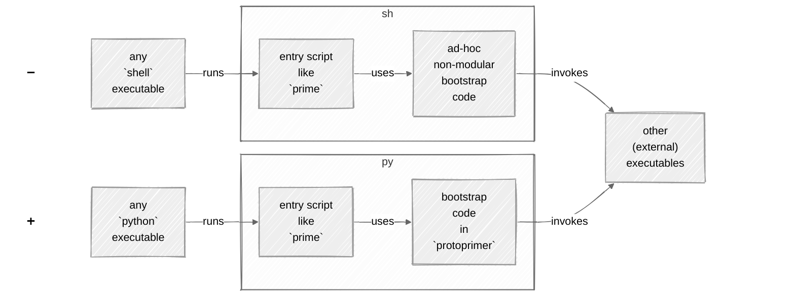
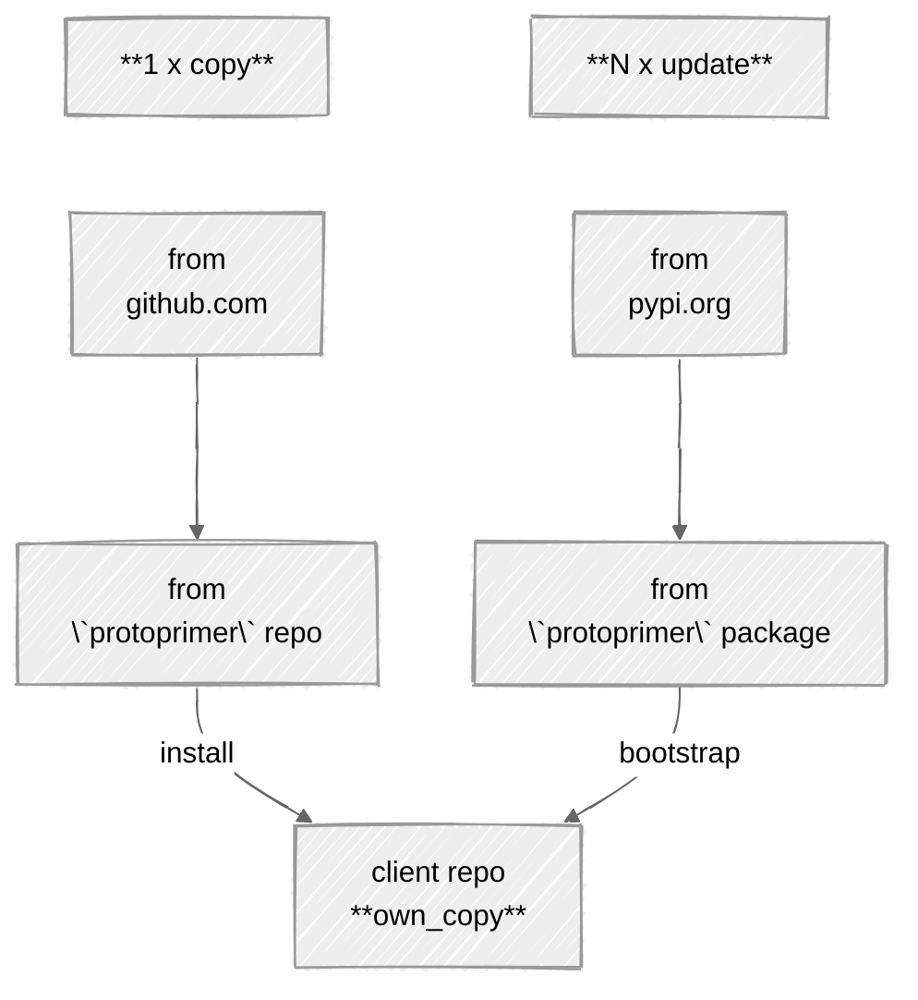
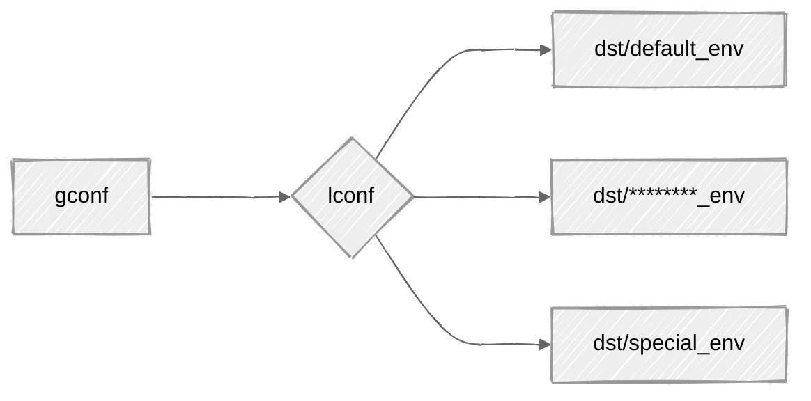
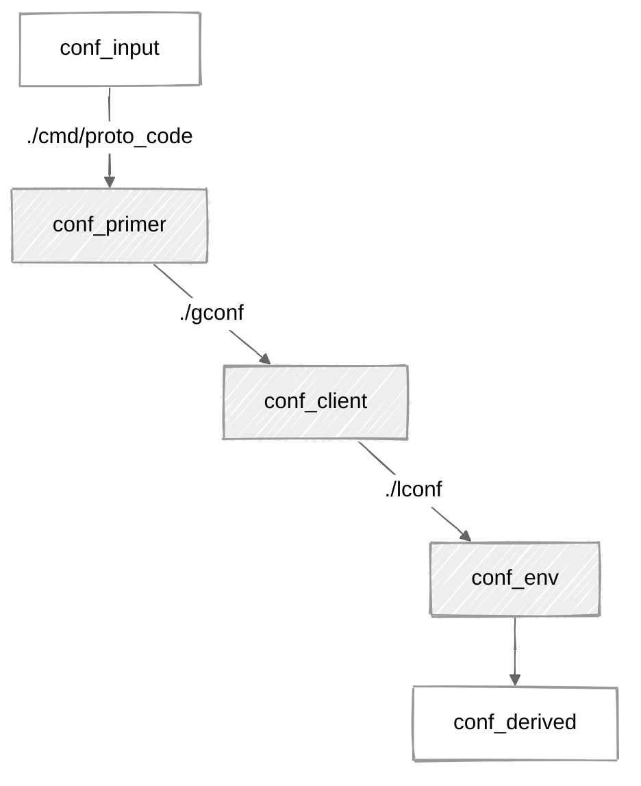

[](https://pypi.org/project/protoprimer)
[](https://github.com/uvsmtid/protoprimer/actions/workflows/test_3.7.yaml)
[](https://github.com/uvsmtid/protoprimer/actions/workflows/test_3.14.yaml)
[](https://github.com/uvsmtid/protoprimer/actions/workflows/lint.yaml)
[](https://github.com/uvsmtid/protoprimer/actions/workflows/doc.yaml)
[](https://coveralls.io/github/uvsmtid/protoprimer)
<!--
FT_84_11_73_28: see supported python versions above.

TODO: Use links to FC/UC docs under `./doc` (when ready) from this readme to navigate to details.
-->

# `protoprimer`

*   An **app** to bootstrap (not only) `python` projects in a single click (from fresh repo clone).
*   A **lib** to switch `python` runtime into `venv` directly (avoiding intermediate `shell` wrappers).

## TL;DR

The `protoprimer` provides a **single-touch** pure `python` bootstrap (without details confusing users):

```sh
./prime
```

It switches to the required `python` version and creates a `venv` specific to the environment of that repo clone:
*   dev or prod
*   local or cloud
*   Alice or Bob
*   ...

<a id="protoprimer-getting-started"></a>

## Quick start

For the simplest case, see [instant_python_bootstrap][instant_python_bootstrap]:

*   [Copy][initial_copy] (one time):

    ```
    ./
    ├── prime            <--- own copy
    ├── pyproject.toml
    └── *
    ```

    Make your **own copy** of [`proto_kernel.py`][local_proto_kernel.py] to install it named as `prime`.

    Later it can be renamed, (with some configuration) moved under any directory, used by other scripts.

    For now, save it as `prime` next to your `pyproject.toml`, commit the copy to be part of the repo.

*   Run (any time):

    ```sh
    ./prime
    ```

## Typical usage

Bootstrap (default env):

```sh
./prime
```

Bootstrap (special env):

```sh
./prime --env dst/special_env
```

Upgrade: re-create venv, re-solve and re-install deps, re-pin versions:

```sh
./prime --reinstall
```

Review effective config:

```sh
./prime --config
```

## Background

Let's say, [forced by the motivation][protoprimer_motivation],
people dropped `shell` and picked `python` to automate, but...

### Common problem

Every time some `repo.git` is cloned,
it has to be prepared/bootstrapped/primed to make `python` ready.

[](https://www.youtube.com/shorts/gNYgeAxCK3M)

Because `python` is **not** ready yet,\
`shell`-scripts are used to work around that. Again!

Ultimately, can we stick to `python`-only tools for `python`?

### General idea

Replace the role of the `shell`:\
➖ instead of relying on the presence of a `shell` executable to bootstrap `python`\
➕ rely on a `python` executable (of any version) to bootstrap the required `python` version



### Approach: min outside, max inside

Wrap the details into a **single-touch**, self-contained, no-deps, no-args, cross-platform, ...\
command started by an **arbitrary** `python` version to bootstrap the required one:

```sh
./prime
```

Under the hood, the `protoprimer` handles the non-trivial steps
(switching `python` executable, supporting different environments, ...)
to transition runtime state and pass the control
to the client code which customizes and completes the bootstrap process.

### Why not `uv`?

Yes, the `protoprimer` relies on `uv`.\
Yet, it runs `python` first.

<details>
<summary>details</summary>

Relying on `python` first:
*   is more robust for the **single-touch** bootstrap (`python` is more ubiquitous than `uv`)
*   uses **easily modifiable** local _interpreted_ `python` code to wrap calls to any _compiled_ binary (like `uv`)

In short, `uv` is one of many other executables (external to `python`) employable for bootstrapping.

Also, `uv` is hardly **single-touch** without a wrapper:
*   Its binary has to be prepared. How? A wrapper.
*   Its args have to be provided. How? A wrapper.
*   Full bootstrap requires a few `uv` invocations. How? A wrapper.
*   Users want these details hidden. How? A wrapper.

It is **not** ideal to re-invent such wrappers for every project.

</details>

### Project focus

The `protoprimer` **covers the details** for these two use cases:
*   **app**: bootstrapping required `python` version and `venv` by arbitrary `python` from the `PATH`
*   **lib**: executing `python` scripts directly (without explicit `venv` activation and `shell` wrappers)

... and exposes API-s to reuse its internals (e.g. config discovery, DAG, ...).

<a id="protoprimer-motivation"></a>

## Motivation: single-touch `python` code launch (avoiding `shell`)

In short, `shell` is a **deceptive trap**:
1.  it makes interactive typing concise and ubiquitous for CLI (everyone knows it)
2.  yet it is a very poor lang for evolving software

<details>
<summary>details</summary>

Why avoid `shell`?
*   :x: non-testable (test code for `shell`-scripts is close to none)
*   :x: subtle error-prone pitfalls (e.g. no halt on error by default, `shopt`-modified behavior)
*   :x: unpredictable local/user overrides (e.g. `PATH` points to non-standard external binaries like `ls`)
*   :x: cryptic "write-only" syntax (e.g. `echo "${file_path##*/}"` vs `os.path.basename(file_path)`)
*   :x: no stack traces on failure (encourages excessive logging)
*   :x: limited native data structures (no nested ones)
*   :x: no modularity (code larger than one-page-one-file is cumbersome)
*   :x: no external libraries/packages
*   :x: slower
*   ...

**The main obstacle** to overcome all that is to make any alternative as immediately runnable as `shell`.

</details>

The `protoprimer` targets `python` as the alternative:
*   `python` occupies the equivalent niche (as `shell`)
*   `python` maintains vast mind share (as `shell`)
*   `protoprimer` enables **single-touch** `python` code execution using:
    *   required `python` version
    *   required dependencies in `venv`

## Why `proto*`?

`proto` = early, when nothing exists yet.

The `protoprimer` design aims to survive with **minimal pre-conditions**:

*   no pre-installed dependencies
*   no pre-initialized `venv`
*   no required `python` version in `PATH`
*   no special shell config
*   no user CLI args to guess (by default)
*   ...
*   just naked `python` (relatively omnipresent) + [a stand-alone copy][FT_90_65_67_62.proto_code.md] of the `protoprimer`.

## What are the primary features?

The single primary feature is handling the set of early bootstrap steps:
*   running under **the inconvenient conditions**
*   being **very boring** to re-invent

<details>
<summary>details</summary>

Those early bootstrap steps:
*   distinguish (A) global repo-wide and (B) local environment-specific configuration
*   office-friendly: supporting limited permissions, mirrors for package indexes, proxies, etc.
*   respect flexible repo filesystem layouts - from min to max (choices made by the target client repo)
*   init `venv`, install the necessary dependencies, pin package versions
*   switch initial arbitrary OS-picked `python` binary from the `PATH` to the required version
*   propagate param overrides: config fields - env vars - CLI args
*   delegate to client-specific modules to do the rest\
    (**to run more interesting stuff**)

</details>

This mono repo is roughly divided into:
*   **hard**: **pre**-`venv` runtime is the scope of `protoprimer` (the main focus)
*   **easy**: **post**-`venv` runtime is the scope of `neoprimer` (useful but not essential)

## The stand-alone copy: proto code

Installing the `protoprimer` as a package would introduce the "chicken & egg" problem
because that package requires `venv` (which is the very thing the `protoprimer` is supposed to create).

Instead, the (proto code) script is stand-alone (a copy from this repo),
but it auto-updates itself from the `protoprimer` package when `venv` is ready:
*   install = 1 x copy
*   bootstrap = N x update



## Distinction: proto code vs entry script

*   ["proto code"][FT_90_65_67_62.proto_code.md] ~ `./cmd/proto_code/proto_kernel.py`

    A copy of [`proto_kernel.py`][local_proto_kernel.py] stored in the client target repo.

    Only a **single** copy of the proto code script is needed per repo.

*   ["entry script"][FT_75_87_82_46.entry_script.md] ~ `./prime`

    Any script that relies on the proto code to run.

    There can be **many** entry scripts per repo.

    In this repo:

    *   there are scripts like `./prime` using proto code as an **app** (bootstrap).

    *   there are many others in [cmd][cmd] dir using proto code as a **lib**.

### Example (this repo): proto code vs entry script

Instead of the `path/to/own_copy`, this repo uses this specific path for **proto code**:

```sh
./cmd/proto_code/proto_kernel.py --help
```

However, for brevity, the rest of this doc uses this **entry script** (which invokes the proto code):

```sh
./prime --help
```

<a id="protoprimer-install-copy"></a>

## Installation: initial 1 x copy

*   Get the `own_copy` of the [`proto_kernel.py`][local_proto_kernel.py]:

    ```sh
    git fetch --depth 1 https://github.com/uvsmtid/protoprimer main
    git show FETCH_HEAD:cmd/proto_code/proto_kernel.py > path/to/own_copy
    chmod u+x path/to/own_copy
    ```

    Feel free to move the `own_copy` under any name or any path within the target client repo.

*   Commit the `own_copy` to make it immediately available on the repo clone:

    ```sh
    git add path/to/own_copy
    git commit -m 'Copy `proto_kernel.py` from `protoprimer`'
    ```

<a id="protoprimer-effective-config"></a>

## Effective configuration

It is possible to generate effective config to see:
*   the data **loaded** from files
*   the data **derived** from the **loaded** data

```sh
./prime --config
```

The output uses dynamically generated annotations to explain the purpose of each field.

## Configuration: global vs local

The `protoprimer` supports:
*   `gconf` ~ global config: shared between all environments (repo clones)
*   `lconf` ~ local config: private to specific environments (repo clones)



For example, this repo has:

| sample paths                | track changes |                                                          |
|-----------------------------|---------------|----------------------------------------------------------|
| `gconf/*`                   | yes           | dir with global config                                   |
| `lconf -> dst/default_env/` | **no**        | dir with selected local config (symlink to specific env) |
| `dst/*/*`                   | yes           | config dirs for different envs (`lconf` symlink targets) |

To bootstrap in any other (non-default) env, run:

```sh
./prime --env dst/special_env
```

The existence of `lconf` symlink (and where it points to)
is private to the repo clone (and should be `.gitignore`-ed)
but all its possible targets in `dst/*` have to be versioned.

## Filesystem layout: configuration leaps

The `protoprimer` supports any filesystem layout for client repos.

To discover the config files within the filesystem, it uses the concept of "config leap" - see:

```
./prime --config
```



*   `leap_input`: not a file - represents data available to the process (env vars, CLI args, etc.)
*   [`leap_primer`][leap_primer]: allows "proto code" to find the client repo "global config"
*   [`leap_client`][leap_client]: provides "global config" and allows finding the target env "local config"
*   [`leap_env`][leap_env]: provides "local config"
*   `leap_derived`: not a file - represents effective config data derived from all the other data

## Required `python`: switching executables

The stand-alone "proto code" is designed to be run by any `python` executable (available in `PATH`).

Eventually, based on the target client repo requirements, it must become:
*   specific `python` version
*   executed from the initialized `venv` (with all dependencies)

To achieve this, the `protoprimer` switches `python` executables in a multi-staged bootstrap sequence:

```sh
./prime -v
```

Each executable is replaced with `os.execve` call.

<!--
TODO: To support Windows, `os.execve` will have to be changed to use `subprocess` with a chain of children.
-->

## Reproducible `venv`: version pinning

To make bootstrap reproducible for any target env, the `protoprimer` supports version pinning (locking):
*   the actual dependencies are specified in the individual [pyproject.toml][pyproject.toml] per project
*   the versions are constrained by [constraints.txt][constraints.txt] managed for selected env (for "local config")

In short:
*   `pyproject.toml` lists the dependencies (and version ranges)
*   `constraints.txt` pins the dependencies to specific versions

<a id="protoprimer-upgrade-project"></a>

## Upgrading versions

To re-create `venv`, re-install the deps, and re-pin the versions, run:

```sh
./prime --reinstall
```

To control the dependency versions, spec them inside the [pyproject.toml][pyproject.toml] files.

<!--
TODO: UC_52_87_82_92.conditional_auto_update.md: update when disabling auto-update is possible.
TODO: UC_61_12_90_59.reinstall_venv.md: update for use cases with --reinstall vs some sort of update.
-->

## Delegation to client code

The bootstrap uses an extensible [DAG][DAG_wiki] to reach a specific state with all its dependencies.

For example,\
[`./prime`][local_prime] (a trivial proxy) relies on\
[`proto_kernel.py`][local_proto_kernel.py] (a local stand-alone copy)\
which:
*   first, bootstraps the environment via itself (outside `venv`),
*   then, continues to bootstrap it via `protoprimer.primer_kernel` (inside `venv`)
*   auto-updates the copy within the client repo (to be available on repo clone)
*   eventually passes control back to trigger additional client-specific steps

<!--
## How to extend and customize it?

TODO: FT_93_57_03_75.app_vs_lib.md: Explain examples `./cmd/hello_world_via_app` and `./cmd/hello_world_via_lib`

-->

## This repo directory structure: monorepo with related projects

Each subdirectory of [src][src] directory contains related sub-projects (with `pyproject.toml` files):
*   [protoprimer][protoprimer] addresses running `python` code before `venv` is fully configured
*   [neoprimer][neoprimer] contains extensions with code useful to run after `venv` is fully configured
*   non-releasable for this repo:
    *   [local_repo][local_repo] support scripts
    *   [local_test][local_test] test-related helpers
    *   [local_doc][local_doc] documentation-related helpers

---

[readme.md]: readme.md

[local_proto_kernel.py]: cmd/proto_code/proto_kernel.py
[local_primer_kernel.py]: src/protoprimer/main/protoprimer/primer_kernel.py

[local_prime]: prime

[local_doc]: src/local_doc
[local_repo]: src/local_repo
[local_test]: src/local_test
[protoprimer]: src/protoprimer
[neoprimer]: src/neoprimer

[src]: src
[cmd]: cmd

[FT_90_65_67_62.proto_code.md]: doc/feature_topic/FT_90_65_67_62.proto_code.md
[FT_75_87_82_46.entry_script.md]: doc/feature_topic/FT_75_87_82_46.entry_script.md
[SOLID_wiki]: https://en.wikipedia.org/wiki/SOLID
[DAG_wiki]: https://en.wikipedia.org/wiki/Directed_acyclic_graph
[make_wiki]: https://en.wikipedia.org/wiki/Make_(software)
[systemd_wiki]: https://en.wikipedia.org/wiki/Systemd
[FT_57_87_94_94.bootstrap_process.md]: doc/feature_topic/FT_57_87_94_94.bootstrap_process.md

[leap_primer]: cmd/proto_code/proto_kernel.json
[leap_client]: gconf/proto_kernel.json
[leap_env]: dst/default_env/proto_kernel.json

[constraints.txt]: dst/default_env/constraints.txt
[pyproject.toml]: src/neoprimer/pyproject.toml

[getting_started]: #protoprimer-getting-started
[protoprimer_motivation]: #protoprimer-motivation
[initial_copy]: #protoprimer-install-copy
[effective_config]: #protoprimer-effective-config
[subsequent_upgrade]: #protoprimer-upgrade-project

[instant_python_bootstrap]: https://github.com/uvsmtid/instant_python_bootstrap
