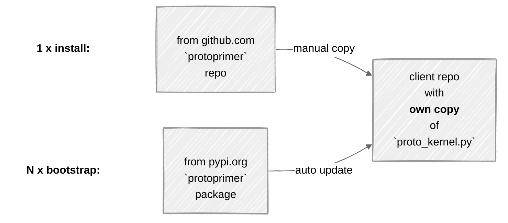

[](https://pypi.org/project/protoprimer)
[](https://github.com/uvsmtid/protoprimer/actions/workflows/test_py_min.yaml)
[](https://github.com/uvsmtid/protoprimer/actions/workflows/test_py_med.yaml)
[](https://github.com/uvsmtid/protoprimer/actions/workflows/test_py_max.yaml)
[](https://github.com/uvsmtid/protoprimer/actions/workflows/lint.yaml)
[](https://github.com/uvsmtid/protoprimer/actions/workflows/doc.yaml)
[](https://coveralls.io/github/uvsmtid/protoprimer)
<!--
FT_84_11_73_28.supported_python_versions.md: see above.

TODO: Use links to FC/UC docs under `./doc` (when ready) from this readme to navigate to details.
-->

# <code><a href="https://protoprimer.readthedocs.io/"></a></code>

# `protoprimer`

Want your users to run software straight from a `git` repo with a single, zero-argument, healing command?

```sh
./prime
```

If not, [double confirm][protoprimer_readthedocs].

## Typical usage

*   Bootstrap (default env):

    ```
    ./prime
    ```

*   Bootstrap (special env):

    ```
    ./prime --env dst/special_env
    ```

*   From scratch: re-create venv, re-solve and re-install deps, re-pin versions:

    ```
    ./prime reboot
    ```

*   Evaluate the effective config:

    ```
    ./prime eval
    ```

*   Start an interactive `shell` with an activated `venv`:

    ```
    ./cmd/venv_shell
    ```

<a id="protoprimer-quick-start"></a>

## Quick start

You need to "seed" your repo by a copy of the [`proto_kernel.py`][local_proto_kernel.py] script:


```mermaid
---
config:
  look: handDrawn
  theme: neutral
---
graph LR;

    install_link["<b>1 x install:</b>"]
    github_web["<br>from github.com<br>`protoprimer`<br>repo"]

    bootstrap_link["<b>N x bootstrap:</b>"];
    pypi_web["<br>from pypi.org<br>`protoprimer`<br>package"]

    client_repo["client repo<br>with<br><b>own copy</b><br>of<br>`proto_kernel.py`"];

    install_link ~~~ github_web;
    github_web --manual copy--> client_repo;

    bootstrap_link ~~~ pypi_web;
    pypi_web --auto update--> client_repo;

    style install_link fill:none,stroke:none;
    style bootstrap_link fill:none,stroke:none;
```

*   Copy (one time):

    Commit your **own copy** next to `pyproject.toml`:

    ```
    ./
    ├── proto_kernel.py    <--- own copy
    ├── pyproject.toml
    └── *
    ```

    The location, name, details can be changed through optional config.

*   Run (any time):

    ```sh
    ./proto_kernel.py
    ```

<a id="protoprimer-proto-code-vs-entry-script"></a>

## "proto code" vs "entry scripts"

*   **"proto code"** is any code designed to be executed by arbitrary `python` version.

    The own copy of `proto_kernel.py` is the hard part but handled entirely by `protoprimer`.

*   **"entry script"** relies on `proto_kernel.py` to switch into `venv`.

    Technically, an "entry script" is also "proto code" but the easy part as it only delegates.

<a id="protoprimer-hello-world"></a>

## "Hello, world!"

*   An "entry script" executes "proto code" by a **wild** `python` version found in `PATH`.

*   But `custom_main` is executed by the **required** `python` version inside the isolated `venv`.

*   See how an entry script extends bootstrap:

    ```py
    # ./cmd/boot_env:
    # ...
    proto_kernel.boot_env("local_doc.cmd_boot_env:custom_main")
    ```

    ```sh
    ./cmd/boot_env
    ```

*   See how an entry script launches `some_main` function:

    ```py
    # ./cmd/start_app:
    # ...
    proto_kernel.start_app("local_doc.cmd_start_app:custom_main")
    ```

    ```sh
    ./cmd/start_app
    ```

[readme.md]: readme.md

[protoprimer_readthedocs]: https://protoprimer.readthedocs.io/

[pyapp_project]: https://github.com/ofek/pyapp

[local_proto_kernel.py]: cmd/proto_code/proto_kernel.py
[local_primer_kernel.py]: src/protoprimer/main/protoprimer/primer_kernel.py

[local_prime]: prime

[local_doc]: src/local_doc
[local_repo]: src/local_repo
[local_test]: src/local_test
[protoprimer]: src/protoprimer
[metaprimer]: src/metaprimer

[src_dir]: src
[cmd_dir]: cmd

[FT_90_65_67_62.proto_code.md]: doc/feature_topic/FT_90_65_67_62.proto_code.md
[FT_75_87_82_46.entry_script.md]: doc/feature_topic/FT_75_87_82_46.entry_script.md
[FT_57_87_94_94.bootstrap_process.md]: doc/feature_topic/FT_57_87_94_94.bootstrap_process.md

[SOLID_wiki]: https://en.wikipedia.org/wiki/SOLID
[DAG_wiki]: https://en.wikipedia.org/wiki/Directed_acyclic_graph
[make_wiki]: https://en.wikipedia.org/wiki/Make_(software)
[systemd_wiki]: https://en.wikipedia.org/wiki/Systemd

[constraints.txt]: dst/default_env/constraints.txt
[pyproject.toml]: src/metaprimer/pyproject.toml

[quick_start]: #protoprimer-quick-start
[proto_code_vs_entry_script]: #protoprimer-proto-code-vs-entry-script
[hello_world]: #protoprimer-hello-world

<!-- markdownlint-disable MD051 -->
<!--
NOTE: This "user-content-" prefix is added by github.com when it renders the Markdown into HTML.
-->
[shell_issues]: #user-content-shell-issues
<!-- markdownlint-enable -->
