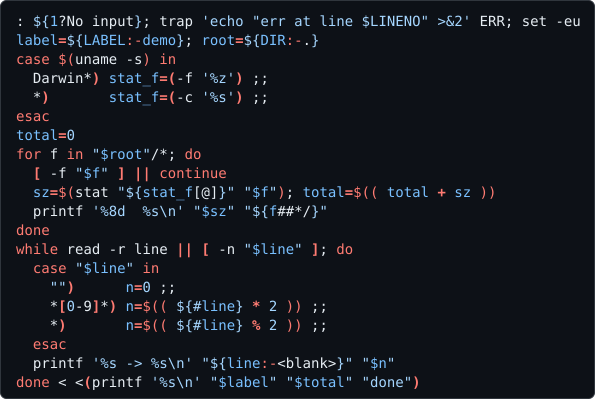
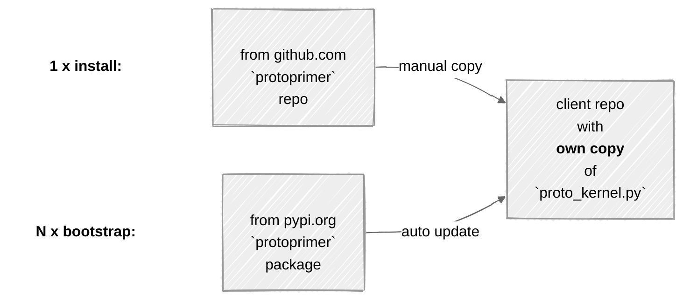

[](https://pypi.org/project/protoprimer)
[](https://github.com/uvsmtid/protoprimer/actions/workflows/test_py_min.yaml)
[](https://github.com/uvsmtid/protoprimer/actions/workflows/test_py_med.yaml)
[](https://github.com/uvsmtid/protoprimer/actions/workflows/test_py_max.yaml)
[](https://github.com/uvsmtid/protoprimer/actions/workflows/lint.yaml)
[](https://github.com/uvsmtid/protoprimer/actions/workflows/doc.yaml)
[](https://coveralls.io/github/uvsmtid/protoprimer)
<!--
FT_84_11_73_28.supported_python_versions.md: see above.

TODO: Use links to FC/UC docs under `./doc` (when ready) from this readme to navigate to details.
-->

<!-- NOTE: style="width: 11ch" ~ 11 chars = len("protoprimer"); snippet locked to height: 11ch so both track the same ch unit -->

# <code style="white-space: nowrap;"><a href="https://protoprimer.readthedocs.io/"></a>&nbsp;</code>

# `protoprimer`

Want your users to run software straight from a `git` repo with a single, zero-argument, healing command?

```sh
./prime
```

Please [read the docs][protoprimer_readthedocs] for an intro.

## TL;DR

`protoprimer` employs ubiquitous `python` for version pinning to provide a robust alternative to `shell`:

*   First, a shim is executed by a **wild** `python` version found in `PATH` invoking `protoprimer`.
*   Last, `protoprimer` executes target code by the **required** `python` version from configured `venv`.

It works without `shebang` for `venv` to **avoid hardcoding** absolute paths and keep repo clones **relocatable**.

## Typical usage

*   Bootstrap (default env):

    ```
    ./prime
    ```

*   Bootstrap (special env):

    ```
    ./prime --env dst/special_env
    ```

*   From scratch: re-create venv, re-solve and re-install deps, re-pin versions:

    ```
    ./prime reset
    ```

*   Evaluate the effective config:

    ```
    ./prime eval
    ```

*   Start an interactive `shell` with an activated `venv`:

    ```
    ./cmd/venv_shell
    ```

*   Run a function from a module in `venv` via an `entry_script` wrapper:

    ```
    ./cmd/start_app_example
    ```

<a id="protoprimer-quick-start"></a>

## Quick start

You need to "seed" your repo with a copy of the [`proto_kernel.py`][local_proto_kernel.py] script:


```mermaid
---
config:
  look: handDrawn
  theme: neutral
---
graph LR;

    install_link["<b>1 x install:</b>"]
    github_web["<br>from github.com<br>`protoprimer`<br>repo"]

    bootstrap_link["<b>N x bootstrap:</b>"];
    pypi_web["<br>from pypi.org<br>`protoprimer`<br>package"]

    client_repo["client repo<br>with<br><b>own copy</b><br>of<br>`proto_kernel.py`"];

    install_link ~~~ github_web;
    github_web --manual copy--> client_repo;

    bootstrap_link ~~~ pypi_web;
    pypi_web --auto update--> client_repo;

    style install_link fill:none,stroke:none;
    style bootstrap_link fill:none,stroke:none;
```

*   Copy (one time):

    Commit your **own copy** next to `pyproject.toml`:

    ```
    ./
    ├── proto_kernel.py    <--- own copy
    ├── pyproject.toml
    └── *
    ```

    The location, name, and details can be changed through optional config.

*   Run (any time):

    ```sh
    ./proto_kernel.py
    ```

## Entry functions

There are two entry functions - see details in [boot_vs_start][FT_58_74_37_70.boot_vs_start.md]:

| Function:    | [start_app][FT_05_08_64_67.start_app.md]                     | [boot_env][FT_85_17_35_21.boot_env.md]                |
|--------------|--------------------------------------------------------------|-------------------------------------------------------|
| Purpose:     | run **arbitrary** script<br>from `venv` by required `python` | **extend** the default bootstrap<br>with custom steps |
| Cardinality: | **many** per project                                         | **one** per project                                   |
| Executes:    | smaller part of `proto_kernel`                               | bigger part of `proto_kernel`                         |
| Example:     | `./cmd/start_app_example`                                    | `./cmd/boot_env_example`                              |

<a id="protoprimer-first-examples"></a>

## First examples

### Minimal application script invoked via `start_app`

This `entry_script` invokes the [cmd_start_app_example][cmd_start_app_example] script:

```sh
./cmd/start_app_example
```

`proto_kernel.start_app` **delegates** execution to an arbitrary `custom_start_app_main` function:

```py
# ./cmd/start_app_example:
# ...
proto_kernel.start_app(
    # module_name:function_name
    "local_doc.cmd_start_app_example:custom_start_app_main"
)
```

### Baseline bootstrap script invoked via `boot_env`

This `entry_script` extends the bootstrap sequence via the [cmd_boot_env_example][cmd_boot_env_example] script:

```sh
./cmd/boot_env_example
```

`proto_kernel.boot_env` **triggers** all the bootstrap steps before invoking the `custom_boot_env_main` function:

```py
# ./cmd/boot_env_example:
# ...
proto_kernel.boot_env(
    # module_name:function_name
    "local_doc.cmd_boot_env_example:custom_boot_env_main"
)
```

## Basic terms

<a id="protoprimer-proto-code"></a>

### Any [proto_code][FT_90_65_67_62.proto_code.md]

Any code designed to be executed by an arbitrary (wild) `python` version is called `proto_code`.

In short, `proto_code` is what runs outside `venv` before switching into it.

<a id="protoprimer-proto-kernel"></a>

### Single [proto_kernel][FT_87_17_49_36.proto_kernel.md]

Your own copy of `proto_kernel.py` is an example of `proto_code`.

It implements in-flight `python` runtime switching - the **hard** part provided by `protoprimer`.

<a id="protoprimer-entry-script"></a>

### Multiple [entry_script][FT_75_87_82_46.entry_script.md]-s

An `entry_script` is also `proto_code` - a shim to invoke `proto_kernel`.

They are convenient wrappers to invoke any function - the **easy** part as they only delegate:

```sh
./cmd/start_app_example
./cmd/boot_env_example
# ...
```

<a id="protoprimer-entry-functions"></a>

[protoprimer_readthedocs]: https://protoprimer.readthedocs.io/

[local_proto_kernel.py]: cmd/proto_code/proto_kernel.py

[FT_90_65_67_62.proto_code.md]: doc/feature_topic/FT_90_65_67_62.proto_code.md
[FT_87_17_49_36.proto_kernel.md]: doc/feature_topic/FT_87_17_49_36.proto_kernel.md
[FT_75_87_82_46.entry_script.md]: doc/feature_topic/FT_75_87_82_46.entry_script.md
[FT_05_08_64_67.start_app.md]: doc/feature_topic/FT_05_08_64_67.start_app.md
[FT_85_17_35_21.boot_env.md]: doc/feature_topic/FT_85_17_35_21.boot_env.md
[FT_58_74_37_70.boot_vs_start.md]: doc/feature_topic/FT_58_74_37_70.boot_vs_start.md

[cmd_boot_env_example]: src/local_doc/main/local_doc/cmd_boot_env_example.py
[cmd_start_app_example]: src/local_doc/main/local_doc/cmd_start_app_example.py

<!-- markdownlint-disable MD051 -->
<!--
NOTE: This "user-content-" prefix is added by github.com when it renders the Markdown into HTML.
-->
<!-- markdownlint-enable -->
