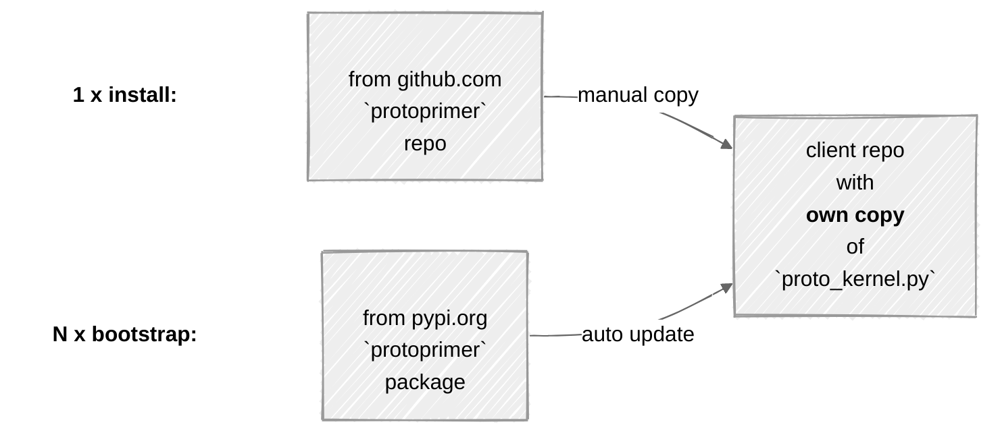

[](https://pypi.org/project/protoprimer)
[](https://github.com/uvsmtid/protoprimer/actions/workflows/test_py_min.yaml)
[](https://github.com/uvsmtid/protoprimer/actions/workflows/test_py_med.yaml)
[](https://github.com/uvsmtid/protoprimer/actions/workflows/test_py_max.yaml)
[](https://github.com/uvsmtid/protoprimer/actions/workflows/lint.yaml)
[](https://github.com/uvsmtid/protoprimer/actions/workflows/doc.yaml)
[](https://coveralls.io/github/uvsmtid/protoprimer)
<!--
FT_84_11_73_28.supported_python_versions.md: see above.

TODO: Use links to FC/UC docs under `./doc` (when ready) from this readme to navigate to details.
-->

<!-- NOTE: style="width: 11ch" ~ 11 chars = len("protoprimer") -->

# <code><a href="https://protoprimer.readthedocs.io/"></a></code>

# `protoprimer`

Want your users to run software straight from a `git` repo with a single, zero-argument, healing command?

```sh
./prime
```

If not, [double confirm][protoprimer_readthedocs].

## Typical usage

*   Bootstrap (default env):

    ```
    ./prime
    ```

*   Bootstrap (special env):

    ```
    ./prime --env dst/special_env
    ```

*   From scratch: re-create venv, re-solve and re-install deps, re-pin versions:

    ```
    ./prime reboot
    ```

*   Evaluate the effective config:

    ```
    ./prime eval
    ```

*   Start an interactive `shell` with an activated `venv`:

    ```
    ./cmd/venv_shell
    ```

<a id="protoprimer-quick-start"></a>

## Quick start

You need to "seed" your repo by a copy of the [`proto_kernel.py`][local_proto_kernel.py] script:


```mermaid
---
config:
  look: handDrawn
  theme: neutral
---
graph LR;

    install_link["<b>1 x install:</b>"]
    github_web["<br>from github.com<br>`protoprimer`<br>repo"]

    bootstrap_link["<b>N x bootstrap:</b>"];
    pypi_web["<br>from pypi.org<br>`protoprimer`<br>package"]

    client_repo["client repo<br>with<br><b>own copy</b><br>of<br>`proto_kernel.py`"];

    install_link ~~~ github_web;
    github_web --manual copy--> client_repo;

    bootstrap_link ~~~ pypi_web;
    pypi_web --auto update--> client_repo;

    style install_link fill:none,stroke:none;
    style bootstrap_link fill:none,stroke:none;
```

*   Copy (one time):

    Commit your **own copy** next to `pyproject.toml`:

    ```
    ./
    ├── proto_kernel.py    <--- own copy
    ├── pyproject.toml
    └── *
    ```

    The location, name, details can be changed through optional config.

*   Run (any time):

    ```sh
    ./proto_kernel.py
    ```

<a id="protoprimer-proto-code"></a>

## `proto_code`

**[proto_code][FT_90_65_67_62.proto_code.md]** is any code designed to be executed by arbitrary `python` version.

The own copy of `proto_kernel.py` is an example of `proto_code` - the **hard** part handled by `protoprimer`.

<a id="protoprimer-entry-script"></a>

## `entry_script`

**[entry_script][FT_75_87_82_46.entry_script.md]** an example of `proto_code`.

`entry_script` relies on `proto_kernel.py` to switch into `venv` - the **easy** part as it only delegates.

<a id="protoprimer-first-scripts"></a>

## `protoprimer` entry functions

*   An `entry_script` executes `proto_code` by a **wild** `python` version found in `PATH`.

*   But `custom_main` is executed by the **required** `python` version inside the isolated `venv`.

There are two entry functions - see details in [boot_vs_start][FT_58_74_37_70.boot_vs_start.md]:

| Function:    | [boot_env][FT_85_17_35_21.boot_env.md]       | [start_app][FT_05_08_64_67.start_app.md]                  |
|--------------|----------------------------------------------|-----------------------------------------------------------|
| Purpose:     | **extend** default bootstrap by custom steps | run **arbitrary** script from `venv` by required `python` |
| Cardinality: | **one** per project                          | **many** per project                                      |
| Example:     | `./cmd/boot_env` (or `./prime`)              | `./cmd/start_app`                                         |

<a id="protoprimer-first-scripts"></a>

## Minimal examples

### Minimal `boot_env`

```sh
./cmd/boot_env
```

This `entry_script` extends bootstrap sequence by invoking `custom_main` via `boot_env`:

```py
# ./cmd/boot_env:
# ...
proto_kernel.boot_env("local_doc.cmd_boot_env:custom_main")
```

### Minimal `start_app`

```sh
./cmd/start_app
```

This `entry_script` runs arbitrary function by invoking its `custom_main` via `start_app`:

```py
# ./cmd/start_app:
# ...
proto_kernel.start_app("local_doc.cmd_start_app:custom_main")
```

[readme.md]: readme.md

[protoprimer_readthedocs]: https://protoprimer.readthedocs.io/

[pyapp_project]: https://github.com/ofek/pyapp

[local_proto_kernel.py]: cmd/proto_code/proto_kernel.py
[local_primer_kernel.py]: src/protoprimer/main/protoprimer/primer_kernel.py

[local_prime]: prime

[local_doc]: src/local_doc
[local_repo]: src/local_repo
[local_test]: src/local_test
[protoprimer]: src/protoprimer
[metaprimer]: src/metaprimer

[src_dir]: src
[cmd_dir]: cmd

[FT_90_65_67_62.proto_code.md]: doc/feature_topic/FT_90_65_67_62.proto_code.md
[FT_75_87_82_46.entry_script.md]: doc/feature_topic/FT_75_87_82_46.entry_script.md
[FT_57_87_94_94.bootstrap_process.md]: doc/feature_topic/FT_57_87_94_94.bootstrap_process.md
[FT_05_08_64_67.start_app.md]: doc/feature_topic/FT_05_08_64_67.start_app.md
[FT_85_17_35_21.boot_env.md]: doc/feature_topic/FT_85_17_35_21.boot_env.md
[FT_58_74_37_70.boot_vs_start.md]: doc/feature_topic/FT_58_74_37_70.boot_vs_start.md

[SOLID_wiki]: https://en.wikipedia.org/wiki/SOLID
[DAG_wiki]: https://en.wikipedia.org/wiki/Directed_acyclic_graph
[make_wiki]: https://en.wikipedia.org/wiki/Make_(software)
[systemd_wiki]: https://en.wikipedia.org/wiki/Systemd

[constraints.txt]: dst/default_env/version_constraints.txt
[pyproject.toml]: src/metaprimer/pyproject.toml

[quick_start]: #protoprimer-quick-start
[first_scripts]: #protoprimer-first-scripts

<!-- markdownlint-disable MD051 -->
<!--
NOTE: This "user-content-" prefix is added by github.com when it renders the Markdown into HTML.
-->
[shell_issues]: #user-content-shell-issues
<!-- markdownlint-enable -->
