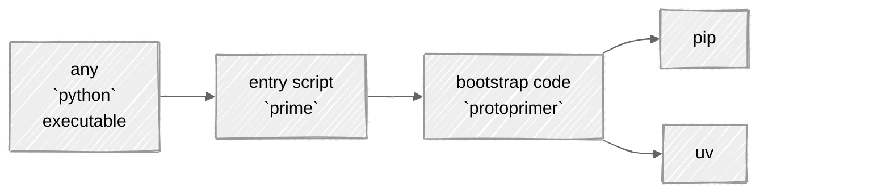
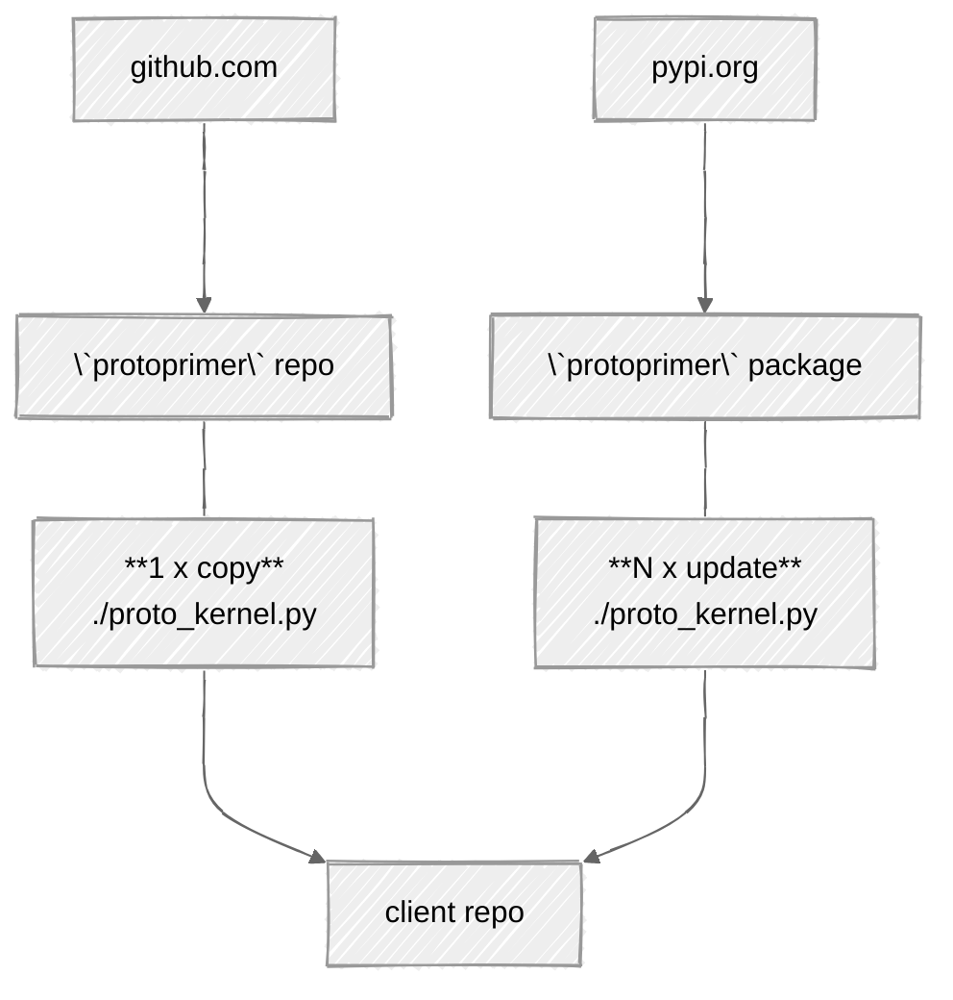
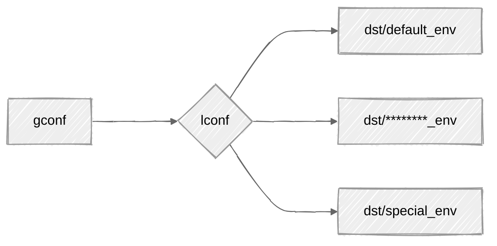
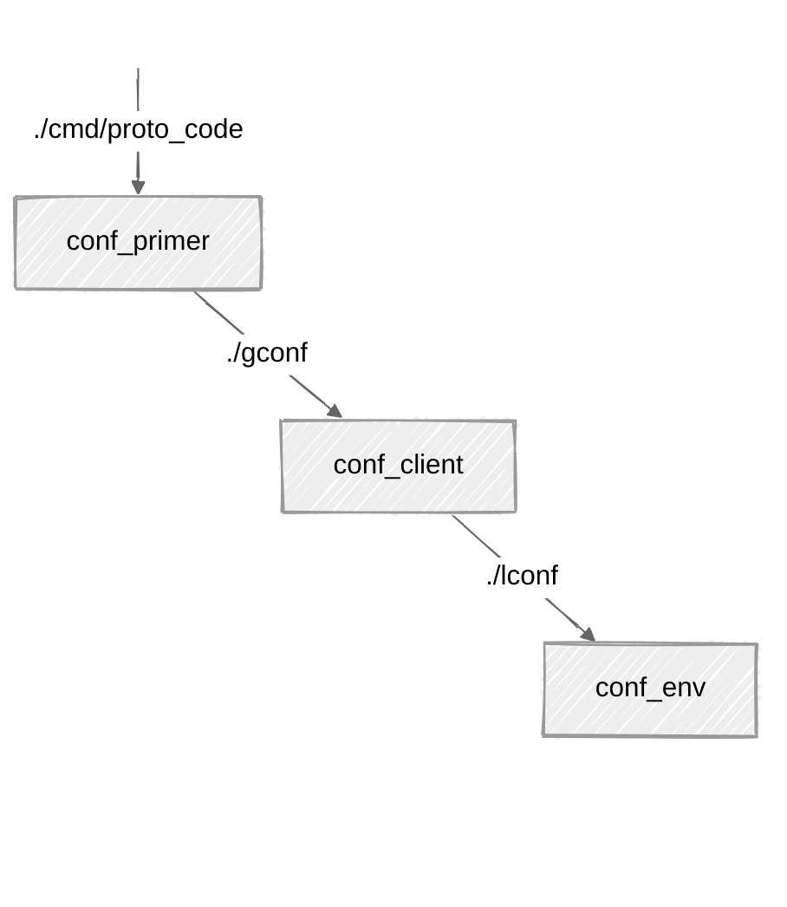

[](https://github.com/uvsmtid/protoprimer)
[](https://pypi.org/project/protoprimer)
<!-- FT_84_11_73_28: supported python versions: -->
[](https://github.com/uvsmtid/protoprimer/actions/workflows/test_3.7.yaml)
[](https://github.com/uvsmtid/protoprimer/actions/workflows/test_3.14.yaml)
[](https://github.com/uvsmtid/protoprimer/actions/workflows/lint.yaml)
[](https://coveralls.io/github/uvsmtid/protoprimer)
<!--
TODO: Use links to docs under `./doc` (when ready) to navigate to details.
-->

# `protoprimer`

A tool for bootstrapping `python` code into `venv` directly (without intermediate `shell` wrappers).

## Intro

Let's say, [forced by the motivation][protoprimer_motivation],\
people dropped `shell` and picked `python` to automate...

### Problem

Every time some `repo.git` is cloned,\
it has to be prepared/bootstrapped/primed to make `python` ready.

Because `python` is **not** ready yet, `shell`-scripts are used to fix that. Again!

### Solution

Instead, consider a one-step no-arg command invoking the `protoprimer`:

```sh
./prime
```

Not a trivial code to afford re-invent-ing this every time (especially, with support for different environments).

### Idea

Invert the role of the shell/`uv`:
*   instead of relying on the presence of shell/`uv` executable to bootstrap `python`
*   rely on the presence of `python` executable (of any version) to bootstrap different `python` version



Relying on `python`:
*   is more robust for the **single-step** bootstrap (due to ubiquitousness of `python` than `uv`)
*   uses **easily modifiable** _interpreted_ `python` code to wrap calls to any _compiled_ binary

Subsequently, `uv` can be used under the hood (optionally) for its speed.

### Focus

The `protoprimer` exposes API-s to reuse its internals (e.g. config discovery, DAG, ...)\
and **hides the details** of both (as an **app** and as a **lib**):
*   bootstrapping required `python` version and `venv` by arbitrary `python` from the `PATH`
*   executing `python` scripts directly (without explicit `venv` activation and `shell` wrappers)

### Usage

Bootstrap (default env):

```sh
./prime
```

Bootstrap (special env):

```sh
#             any/path/to/conf/dir
./prime --env dst/special_env
```

Init basic config:

```sh
./prime --wizard
```

Reset: re-create venv, re-install deps, re-pin versions:

```sh
./prime --reinstall
```

<a id="protoprimer-motivation"></a>

## Motivation

In short, `shell` is a **deceptive trap**:
1.  it makes interactive typing concise and ubiquitous for CLI (everyone knows it)
2.  yet it is a very poor lang for evolving software

<details>
<summary>details</summary>

Why avoid `shell`?
*   :x: non-testable (nobody knows how to write a unit test in `shell`-script)
*   :x: subtle error-prone pitfalls (e.g. no halt on error by default, `shopt`-modified behavior)
*   :x: cryptic write-only syntax (e.g. `echo "${file_path##*/}"` vs `os.path.basename(file_path)`)
*   :x: no stack traces on failure (encourages excessive logging)
*   :x: limited native data structures (no nested ones)
*   :x: no modularity (code larger than one-page-one-file is cumbersome)
*   :x: no external libraries
*   :x: slow
*   ...

**The main obstacle** to overcome all that is to make any alternative as immediately runnable as `shell`.

</details>

The `protoprimer` targets `python` as the alternative:
*   occupies the equivalent niche
*   maintains vast mind share

## Why `proto*`?

`proto` = early, when nothing exists yet.

The `protoprimer` design aims to survive with **minimal pre-conditions**:

*   no pre-installed dependencies
*   no pre-initialized `venv`
*   no required `python` version in `PATH`
*   no special shell config
*   no user CLI args to guess (by default)
*   ...
*   just naked `python` (relatively omnipresent) + [a stand-alone copy][FT_90_65_67_62.proto_code.md] of the `protoprimer`.

## What are the primary features?

Early steps run under **the inconvenient conditions** and they are also **very boring**:
*   distinguish (A) global repo-wide and (B) local environment-specific configuration
*   respect a flexible repo filesystem layout (choices made by the target client repo)
*   init `venv`, install the necessary dependencies, pin package versions
*   switch initial arbitrary OS-picked `python` binary from the `PATH` to the required version
*   delegate to client-specific modules to do the rest (**more interesting stuff**)

The repo is roughly divided into:
*   pre-`venv` runtime is the scope of `protoprimer` (the main focus)
*   post-`venv` runtime is the scope of `neoprimer`

## Installation: stand-alone proto code

Installing it via `pip` on repo clone introduces the "chicken & egg" problem\
because the script must run outside of `venv` (which may not be ready yet).

Instead, the script is stand-alone (copied from this repo),\
but it auto-updates itself via `pip` from the `protoprimer` package when `venv` is ready.



Commit the entire content of [`proto_kernel.py`][local_proto_kernel.py] into the target repo\
(to be immediately available on repo clone).

This single file serves as the ["proto code"][FT_90_65_67_62.proto_code.md].

## Initialization: custom config

It is wizard-able (one-time):

```sh
./proto_kernel.py --wizard
```

**Tip:**
> *   To accept all the defaults quickly, just keep pressing `Enter`.
> *   `Enter` will be safely ignored if a `y` or `n` answer is required.

The generated configuration is reused in all the subsequent repo clones.

## Configuration: global vs local

The `protoprimer` supports:
*   global config: shared between all repo clones
*   local config: private to specific (group of) repo clones



For example, this repo has:

```
gconf/                     # dir with global config
lconf -> dst/default_env/  # dir with local config (symlink to specific env)
dst/*                      # configs for different envs (symlink targets)
```

To bootstrap in any other (non-default) env, run:

```sh
./prime --env dst/special_env
```

The existence of `lconf` symlink (and where it points)\
is private to the repo clone (and should be `.gitignore`-ed)\
but all its possible targets in `dst/*` are still versioned.

| sample paths | track versions |
|--------------|----------------|
| gconf/       | yes            |
| lconf        | no             |
| dst/*        | yes            |

## Filesystem layout: configuration leaps

The `protoprimer` supports any filesystem layout for client repos.



To bootstrap, it employs the concept of "configuration leaps" to find all the config data:
*   [conf_primer][proto_kernel.conf_primer.json]: allows "proto code" finding client repo "global config"
*   [conf_client][proto_kernel.conf_client.json]: provides "global config" and allows finding target env "local config"
*   [conf_env][proto_kernel.conf_env.json]: provides "local config"

<details>
<summary>details</summary>

```python
# ./cmd/proto_code/proto_kernel.conf_primer.json:
conf_primer = {
    # points to the ref root
    # (subsequently, almost all paths are relative to the dir this field points to):
    "primer_ref_root_dir_rel_path": "../..",
    # points to "global config" (relative to the ref root above):
    "primer_conf_client_file_rel_path": "gconf/proto_kernel.conf_client.json",
}

# ./gconf/proto_kernel.conf_client.json:
conf_client = {
    # names the symlink link which points to the current "local config":
    "client_link_name_dir_rel_path": "lconf",
    # points to the default "local config" to bootstrap into (the symlink target dir):
    "client_default_env_dir_rel_path": "dst/default_env",
}

# ./dst/default_env/proto_kernel.conf_env.json:
conf_env = {
    # points to the required `python` version `venv` has to be initialized with:
    "env_local_python_file_abs_path": "/usr/bin/python",
    # points to the `python` project path within this repo:
    "env_project_descriptors": [
        {
            "env_build_root_dir_rel_path": "src/neoprimer",
            "env_install_extras": [],
        },
    ],
}
```

</details>

## Bootstrapping: switching `python` executables

The stand-alone "proto code" is designed to be run by any `python` executable (available in `PATH`).

Eventually, based on the target client repo requirements, it must become:
*   specific `python` version
*   executed from the initialized `venv` (with all dependencies)

To achieve this, the `protoprimer` switches `python` executables in a multi-staged bootstrap sequence:

```sh
./prime -v
```

Each executable is replaced with `os.execve` call.

## Reproducible `venv`: version pinning

To make bootstrap reproducible for any target env, the `protoprimer` supports version pinning (locking):
*   the versions are constrained by [constraints.txt][constraints.txt] generated per target env (per "local config")
*   the actual dependencies are specified in the individual [pyproject.toml][pyproject.toml] per project

In short, `pyproject.toml` lists the dependencies, `constraints.txt` pins them to specific versions.

To re-create `venv`, re-install the deps, and re-pin the versions, run:

```sh
./prime --reinstall
```

Under the hood, the feature is backed by `pip` or `uv`.

<!--
TODO: `uv` is still to be implemented.
-->

## Delegation to client code

The bootstrap uses an extensible [DAG][DAG_wiki] to reach a specific state with all its dependencies.

For example,\
[`./prime`][local_prime] (a trivial proxy) relies on\
[`proto_kernel.py`][local_proto_kernel.py] (a local stand-alone copy)\
which:
*   first, bootstraps the environment via itself (outside `venv`),
*   then, continues to bootstrap it via `protoprimer.primer_kernel` (inside `venv`)
*   auto-updates the copy within the client repo (to be available on repo clone)
*   eventually passes control back to trigger additional client-specific steps

<!--
## How to extend and customize it?

TODO

-->

## This repo directory structure: monorepo with related projects

Each subdirectory of [src][src] directory contains related subprojects (with `pyproject.toml` files):
*   [protoprimer][protoprimer] addresses running `python` code before `venv` is fully configured
*   [neoprimer][neoprimer] contains extensions with code useful to run after `venv` is fully configured
*   [local_repo][local_repo] hosts various non-releasable support scripts for this repo
*   [local_test][local_test] provides non-releasable test help code

---

[readme.md]: readme.md

[local_proto_kernel.py]: cmd/proto_code/proto_kernel.py
[local_primer_kernel.py]: src/protoprimer/main/protoprimer/primer_kernel.py

[local_prime]: prime

[local_repo]: src/local_repo
[local_test]: src/local_test
[protoprimer]: src/protoprimer
[neoprimer]: src/neoprimer

[src]: src
[cmd]: cmd

[original_motivation.md]: doc/dev_note/original_motivation.md
[FT_90_65_67_62.proto_code.md]: doc/feature_topic/FT_90_65_67_62.proto_code.md
[SOLID_wiki]: https://en.wikipedia.org/wiki/SOLID
[DAG_wiki]: https://en.wikipedia.org/wiki/Directed_acyclic_graph
[make_wiki]: https://en.wikipedia.org/wiki/Make_(software)
[systemd_wiki]: https://en.wikipedia.org/wiki/Systemd
[FT_57_87_94_94.bootstrap_process.md]: doc/feature_topic/FT_57_87_94_94.bootstrap_process.md

[proto_kernel.conf_primer.json]: cmd/proto_code/proto_kernel.conf_primer.json
[proto_kernel.conf_client.json]: gconf/proto_kernel.conf_client.json
[proto_kernel.conf_env.json]: dst/default_env/proto_kernel.conf_env.json

[constraints.txt]: dst/default_env/constraints.txt
[pyproject.toml]: src/neoprimer/pyproject.toml

[protoprimer_motivation]: #protoprimer-motivation
