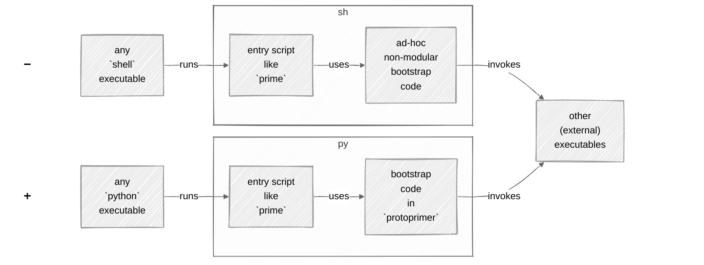
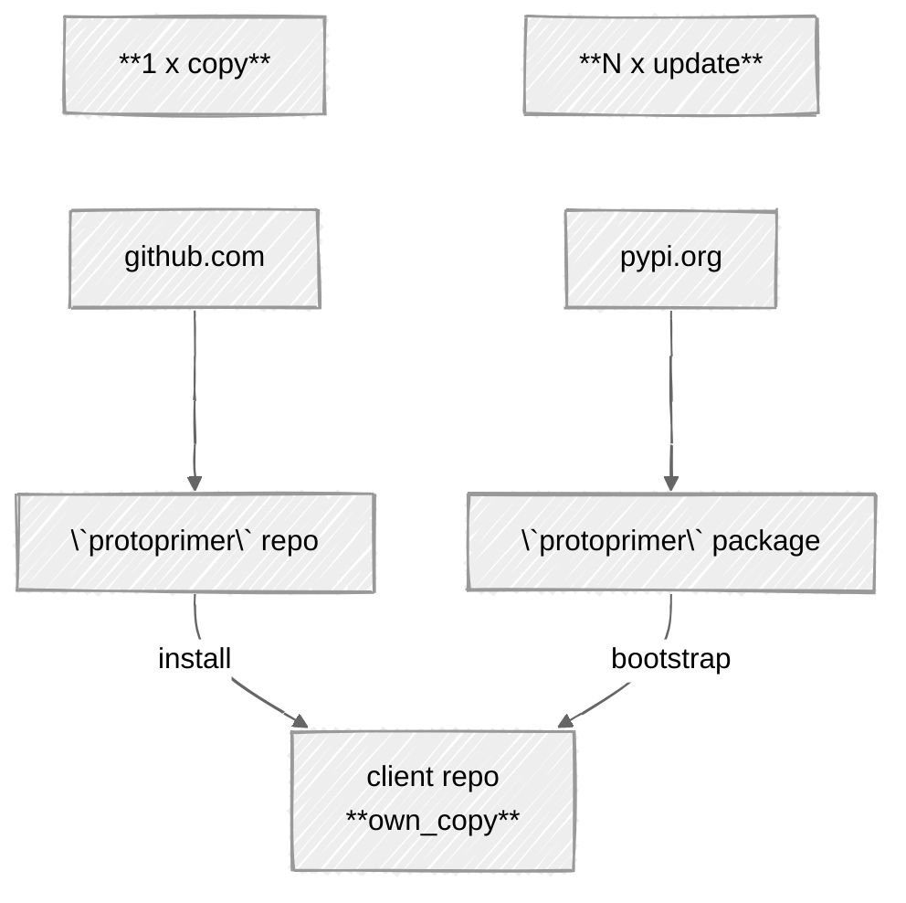
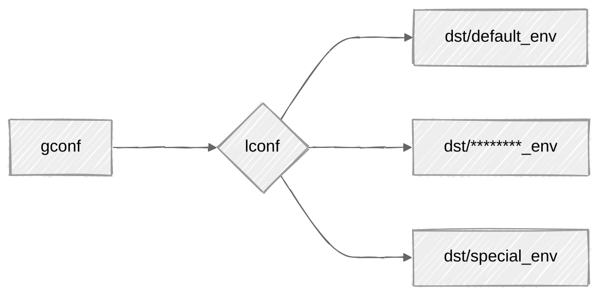
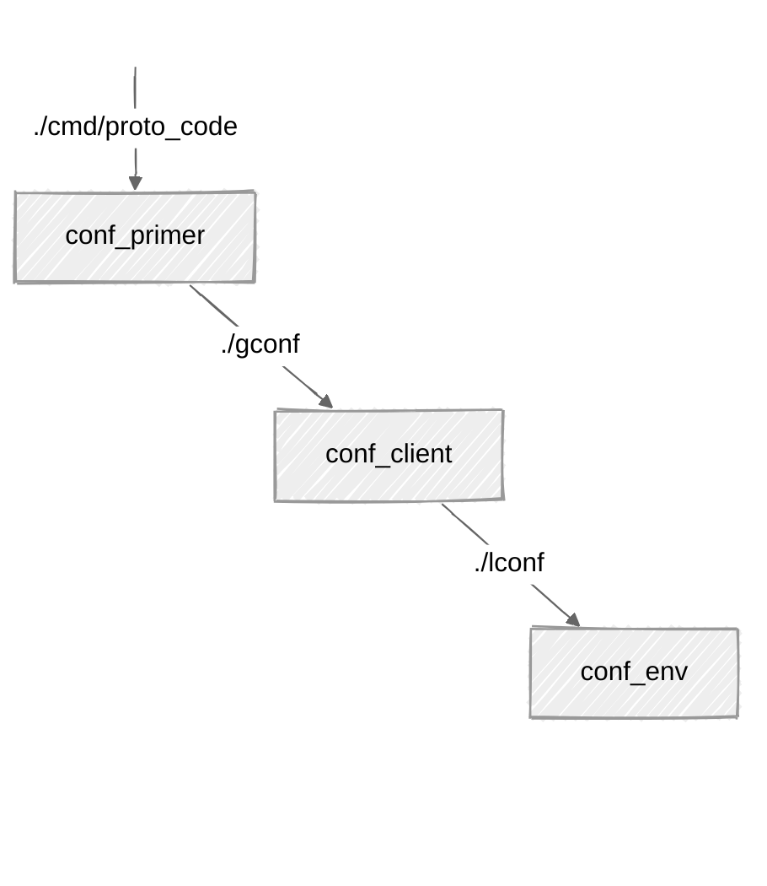

[](https://github.com/uvsmtid/protoprimer)
[](https://pypi.org/project/protoprimer)
[](https://github.com/uvsmtid/protoprimer/actions/workflows/test_3.7.yaml)
[](https://github.com/uvsmtid/protoprimer/actions/workflows/test_3.14.yaml)
[](https://github.com/uvsmtid/protoprimer/actions/workflows/lint.yaml)
[](https://github.com/uvsmtid/protoprimer/actions/workflows/doc.yaml)
[](https://coveralls.io/github/uvsmtid/protoprimer)
<!--
FT_84_11_73_28: see supported python versions above.

TODO: Update `doc` badge to use the doc job.

TODO: Use links to FC/UC docs under `./doc` (when ready) to navigate to details.
-->

# `protoprimer`

An app/lib for bootstrapping `python` code into `venv` directly
(without intermediate `shell` wrappers).

## TL;DR

See [instant_python_bootstrap][instant_python_bootstrap].

The `protoprimer` makes **single-touch** pure `python` commands like this possible (no details confusing users):

```sh
./prime
```

It switches (repo clones) to required `python` version/config
optionally targeting different local environments:
*   local/cloud/...
*   Alice/Bob/...

## Intro

Let's say, [forced by the motivation][protoprimer_motivation],
people dropped `shell` and picked `python` to automate...

### Common problem

Every time some `repo.git` is cloned,
it has to be prepared/bootstrapped/primed to make `python` ready.

Because `python` is **not** ready yet, `shell`-scripts are used to fix that.\
Again!

Ultimately, is this the case `python` needs to rely on anything non-`python`?

### General idea

Replace the role of the `shell`:\
➖ instead of relying on the presence of `shell` executable to bootstrap `python`\
➕ rely on the presence of `python` executable (of any version) to bootstrap required `python` version



### Implemented solution

Wrap the details into **single-touch**, self-contained, no-deps, no-args, ...\
command starting **arbitrary** `python` version to bootstrap the required one:

```sh
./prime
```

Under the hood, the `protoprimer` handles the non-trivial steps
(switching `python` executable, supporting different environments, ...)
to transition runtime state and pass the control
to the client code which customizes and completes the bootstrap process.

### Why not `uv`?

Yes, the `protoprimer` relies on `uv`.\
Yet, it runs `python` first.

<details>
<summary>details</summary>

Relying on `python` first:
*   is more robust for the **single-touch** bootstrap (`python` is more ubiquitous than `uv`)
*   uses **easily modifiable** local _interpreted_ `python` code to wrap calls to any _compiled_ binary (like `uv`)

In short, `uv` is one of many other executables (external to `python`) employable for bootstrapping.

Also, `uv` is hardly **single-touch** without a wrapper:
*   Its binary has to be prepared. How? A wrapper.
*   Its args have to be provided. How? A wrapper.
*   Full bootstrap requires a few `uv` invocations. How? A wrapper.
*   Users want these details hidden. How? A wrapper.

It is **not** ideal to re-invent such wrappers for every project.

</details>

<!--
TODO: `uv` is still to be fully implemented.
-->

### Project focus

The `protoprimer` exposes API-s to reuse its internals (e.g. config discovery, DAG, ...)
and **hides the details** behind these two use cases:
*   **app**: bootstrapping required `python` version and `venv` by arbitrary `python` from the `PATH`
*   **lib**: executing `python` scripts directly (without explicit `venv` activation and `shell` wrappers)

### Typical usage

Bootstrap (default env):

```sh
./prime
```

Bootstrap (special env):

```sh
./prime --env dst/special_env
```

Reset: re-create venv, re-install deps, re-pin versions:

```sh
./prime --reinstall
```

<a id="protoprimer-getting-started"></a>

## Getting started

Use [instant_python_bootstrap][instant_python_bootstrap] to start immediately.

More detailed instructions:
*   [Install][initial_copy] your `own_copy`.
*   [Init][init_config] your (repo) config.
*   [Evolve][subsequent_update] with your dependencies.

<a id="protoprimer-motivation"></a>

## Motivation: single-touch `python` code launch (avoiding `shell`)

In short, `shell` is a **deceptive trap**:
1.  it makes interactive typing concise and ubiquitous for CLI (everyone knows it)
2.  yet it is a very poor lang for evolving software

<details>
<summary>details</summary>

Why avoid `shell`?
*   :x: non-testable (test code for `shell`-scripts is close to none)
*   :x: subtle error-prone pitfalls (e.g. no halt on error by default, `shopt`-modified behavior)
*   :x: unpredictable local/user overrides (e.g. `PATH` points to non-standard external binaries like `ls`)
*   :x: cryptic "write-only" syntax (e.g. `echo "${file_path##*/}"` vs `os.path.basename(file_path)`)
*   :x: no stack traces on failure (encourages excessive logging)
*   :x: limited native data structures (no nested ones)
*   :x: no modularity (code larger than one-page-one-file is cumbersome)
*   :x: no external libraries/packages
*   :x: slower
*   ...

**The main obstacle** to overcome all that is to make any alternative as immediately runnable as `shell`.

</details>

The `protoprimer` targets `python` as the alternative:
*   `python` occupies the equivalent niche (as `shell`)
*   `python` maintains vast mind share (as `shell`)
*   `protoprimer` enables **single-touch** `python` code execution using:
    *   required `python` version
    *   required dependencies in `venv`

## Why `proto*`?

`proto` = early, when nothing exists yet.

The `protoprimer` design aims to survive with **minimal pre-conditions**:

*   no pre-installed dependencies
*   no pre-initialized `venv`
*   no required `python` version in `PATH`
*   no special shell config
*   no user CLI args to guess (by default)
*   ...
*   just naked `python` (relatively omnipresent) + [a stand-alone copy][FT_90_65_67_62.proto_code.md] of the `protoprimer`.

## What are the primary features?

The single primary feature is handling the set of early bootstrap steps:
*   running under **the inconvenient conditions**
*   being **very boring** to re-invent

<details>
<summary>details</summary>

Those early bootstrap steps:
*   distinguish (A) global repo-wide and (B) local environment-specific configuration
*   office-friendly: supporting limited permissions, mirrors for package indexes, proxies, etc.
*   respect flexible repo filesystem layouts - from min to max (choices made by the target client repo)
*   init `venv`, install the necessary dependencies, pin package versions
*   switch initial arbitrary OS-picked `python` binary from the `PATH` to the required version
*   propagate param overrides: config fields - env vars - CLI args
*   delegate to client-specific modules to do the rest\
    (**to run more interesting stuff**)

</details>

This mono repo is roughly divided into:
*   **hard**: **pre**-`venv` runtime is the scope of `protoprimer` (the main focus)
*   **easy**: **post**-`venv` runtime is the scope of `neoprimer` (useful but not essential)

## The stand-alone copy: proto code

Installing the `protoprimer` via a `pip`-like command on repo clone
introduces the "chicken & egg" problem because you need the `protoprimer`
to transition from the arbitrary `python` outside of `venv` to run that `pip`-like command.

Instead, the (proto code) script is stand-alone (copied from this repo),
but it auto-updates itself from the `protoprimer` package when `venv` is ready.



*   [Initial][initial_copy] **1 x copy**: install the stand-alone copy into the target client repo:

    This is a one-time manual process.

    The stand-alone copy (once merged) is reused in all the repo clones.

*   [Subsequent][subsequent_update] **N x update**: bootstrap a specific repo clone

    This is an automatic process.

    The updated stand-alone copy (once merged) is reused in all the repo clones.

    The process is triggered via **one-touch** execution of entry scripts like `./prime`.

The subsequent bootstraps is the main purpose of the `protoprimer` as an app.

<a id="protoprimer-install-copy"></a>

## Installation: initial 1 x copy

*   Get the `own_copy` of the [`proto_kernel.py`][local_proto_kernel.py]:

    ```sh
    git fetch --depth 1 https://github.com/uvsmtid/protoprimer main
    git show FETCH_HEAD:cmd/proto_code/proto_kernel.py > path/to/own_copy
    chmod u+x path/to/own_copy
    ```

    Feel free to move the `own_copy` under any name or any path within the target client repo.

*   Commit the `own_copy` to make it immediately available on the repo clone:

    ```sh
    git add path/to/own_copy
    git commit -m 'Copy `proto_kernel.py` from `protoprimer`'
    ```

### Example from this repo

Instead of the `path/to/own_copy`, this repo uses this specific path for **proto code**:

```sh
./cmd/proto_code/proto_kernel.py --help
```

However, for brevity, the rest of this doc uses this **entry script** (which invokes the proto code):

```sh
./prime --help
```

## Convention: proto code vs entry script

*   ["proto code"][FT_90_65_67_62.proto_code.md] ~ `./cmd/proto_code/proto_kernel.py`

    A copy of [`proto_kernel.py`][local_proto_kernel.py] stored in the client target repo.

    There should be a **single** proto code script per repo.

*   ["entry script"][FT_75_87_82_46.entry_script.md] ~ `./prime`

    Any script that relies on the proto code to run.

    There can be **many** of entry scripts per repo.

    In this repo:

    *   there are scripts like `./prime` using proto code as an **app** (bootstrap).

    *   there are many others in [cmd][cmd] dir using proto code as a **lib**.

<a id="protoprimer-init-config"></a>

## Initialization: custom config

It is wizard-able (one-time):

```sh
./prime --wizard
```

**Tip:**
> *   To accept all the defaults quickly, keep pressing `Enter`.
> *   `Enter` will be safely ignored if a `y` or `n` answer is required.

The wizard is run once to generate configuration.

The generated configuration is reused in all the repo clones.

At the end, the wizard completes the bootstrap of the `venv` (with all the dependencies).

## Configuration: global vs local

The `protoprimer` supports:
*   global config: shared between all repo clones
*   local config: private to specific (group of) repo clones



For example, this repo has:

| sample paths                | track changes |                                                          |
|-----------------------------|---------------|----------------------------------------------------------|
| `gconf/*`                   | yes           | dir with global config                                   |
| `lconf -> dst/default_env/` | **no**        | dir with selected local config (symlink to specific env) |
| `dst/*/*`                   | yes           | config dirs for different envs (`lconf` symlink targets) |

To bootstrap in any other (non-default) env, run:

```sh
./prime --env dst/special_env
```

The existence of `lconf` symlink (and where it points)
is private to the repo clone (and should be `.gitignore`-ed)
but all its possible targets in `dst/*` are still versioned.

## Filesystem layout: configuration leaps

The `protoprimer` supports any filesystem layout for client repos.



To bootstrap, it employs the concept of "configuration leaps" to find all the config data:
*   [conf_primer][proto_kernel.conf_primer.json]: allows "proto code" finding client repo "global config"
*   [conf_client][proto_kernel.conf_client.json]: provides "global config" and allows finding target env "local config"
*   [conf_env][proto_kernel.conf_env.json]: provides "local config"

<details>
<summary>details</summary>

```python
# ./cmd/proto_code/proto_kernel.conf_primer.json:
conf_primer = {
    # points to the ref root
    # (subsequently, almost all paths are relative to the dir this field points to):
    "primer_ref_root_dir_rel_path": "../..",
    # points to "global config" (relative to the ref root above):
    "primer_conf_client_file_rel_path": "gconf/proto_kernel.conf_client.json",
}

# ./gconf/proto_kernel.conf_client.json:
conf_client = {
    # names the symlink link which points to the current "local config":
    "client_link_name_dir_rel_path": "lconf",
    # points to the default "local config" to bootstrap into (the symlink target dir):
    "client_default_env_dir_rel_path": "dst/default_env",
}

# ./dst/default_env/proto_kernel.conf_env.json:
conf_env = {
    # points to the required `python` version `venv` has to be initialized with:
    "required_python_file_abs_path": "/usr/bin/python",
    # points to the `python` project path within this repo:
    "project_descriptors": [
        {
            "env_build_root_dir_rel_path": "src/neoprimer",
            "env_install_extras": [],
        },
    ],
}
```

</details>

## Required `python`: switching executables

The stand-alone "proto code" is designed to be run by any `python` executable (available in `PATH`).

Eventually, based on the target client repo requirements, it must become:
*   specific `python` version
*   executed from the initialized `venv` (with all dependencies)

To achieve this, the `protoprimer` switches `python` executables in a multi-staged bootstrap sequence:

```sh
./prime -v
```

Each executable is replaced with `os.execve` call.

## Reproducible `venv`: version pinning

To make bootstrap reproducible for any target env, the `protoprimer` supports version pinning (locking):
*   the actual dependencies are specified in the individual [pyproject.toml][pyproject.toml] per project
*   the versions are constrained by [constraints.txt][constraints.txt] generated per target env (per "local config")

In short:
*   `pyproject.toml` lists the dependencies (and version ranges)
*   `constraints.txt` pins the dependencies to specific versions

<a id="protoprimer-evolve-project"></a>

## Evolution: subsequent N x update

To re-create `venv`, re-install the deps, and re-pin the versions, run:

```sh
./prime --reinstall
```

To control the dependency versions, spec them inside the [pyproject.toml][pyproject.toml] files.

<!--
TODO: UC_52_87_82_92.conditional_auto_update.md: update when disabling auto-update is possible.
TODO: UC_61_12_90_59.reinstall_venv.md: update for use cases with --reinstall vs some sort of update.
-->

## Delegation to client code

The bootstrap uses an extensible [DAG][DAG_wiki] to reach a specific state with all its dependencies.

For example,\
[`./prime`][local_prime] (a trivial proxy) relies on\
[`proto_kernel.py`][local_proto_kernel.py] (a local stand-alone copy)\
which:
*   first, bootstraps the environment via itself (outside `venv`),
*   then, continues to bootstrap it via `protoprimer.primer_kernel` (inside `venv`)
*   auto-updates the copy within the client repo (to be available on repo clone)
*   eventually passes control back to trigger additional client-specific steps

<!--
## How to extend and customize it?

TODO: FT_93_57_03_75.app_vs_lib.md: Explain examples `./cmd/hello_world_via_app` and `./cmd/hello_world_via_lib`

-->

## This repo directory structure: monorepo with related projects

Each subdirectory of [src][src] directory contains related sub-projects (with `pyproject.toml` files):
*   [protoprimer][protoprimer] addresses running `python` code before `venv` is fully configured
*   [neoprimer][neoprimer] contains extensions with code useful to run after `venv` is fully configured
*   non-releasable for this repo:
    *   [local_repo][local_repo] support scripts
    *   [local_test][local_test] test-related helpers
    *   [local_doc][local_doc] documentation-related helpers

---

[readme.md]: readme.md

[local_proto_kernel.py]: cmd/proto_code/proto_kernel.py
[local_primer_kernel.py]: src/protoprimer/main/protoprimer/primer_kernel.py

[local_prime]: prime

[local_doc]: src/local_doc
[local_repo]: src/local_repo
[local_test]: src/local_test
[protoprimer]: src/protoprimer
[neoprimer]: src/neoprimer

[src]: src
[cmd]: cmd

[FT_90_65_67_62.proto_code.md]: doc/feature_topic/FT_90_65_67_62.proto_code.md
[FT_75_87_82_46.entry_script.md]: doc/feature_topic/FT_75_87_82_46.entry_script.md
[SOLID_wiki]: https://en.wikipedia.org/wiki/SOLID
[DAG_wiki]: https://en.wikipedia.org/wiki/Directed_acyclic_graph
[make_wiki]: https://en.wikipedia.org/wiki/Make_(software)
[systemd_wiki]: https://en.wikipedia.org/wiki/Systemd
[FT_57_87_94_94.bootstrap_process.md]: doc/feature_topic/FT_57_87_94_94.bootstrap_process.md

[proto_kernel.conf_primer.json]: cmd/proto_code/proto_kernel.conf_primer.json
[proto_kernel.conf_client.json]: gconf/proto_kernel.conf_client.json
[proto_kernel.conf_env.json]: dst/default_env/proto_kernel.conf_env.json

[constraints.txt]: dst/default_env/constraints.txt
[pyproject.toml]: src/neoprimer/pyproject.toml

[getting_started]: #protoprimer-getting-started
[protoprimer_motivation]: #protoprimer-motivation
[initial_copy]: #protoprimer-install-copy
[init_config]: #protoprimer-init-config
[subsequent_update]: #protoprimer-evolve-project

[instant_python_bootstrap]: https://github.com/uvsmtid/instant_python_bootstrap
