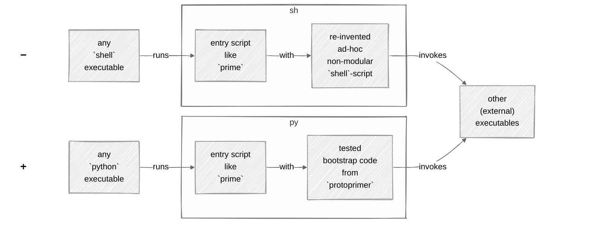
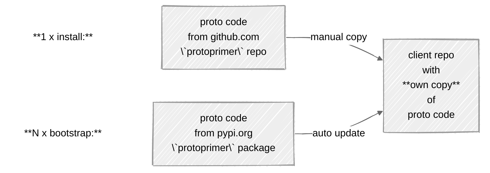
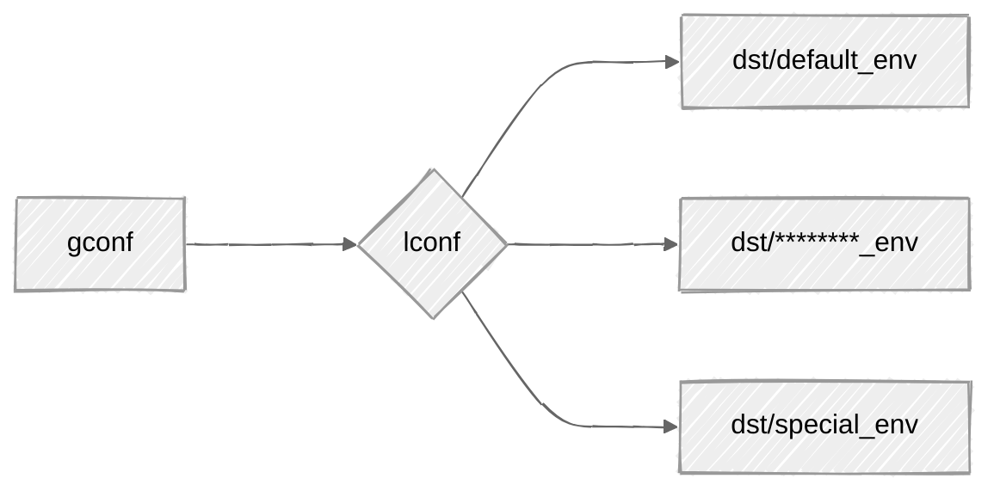
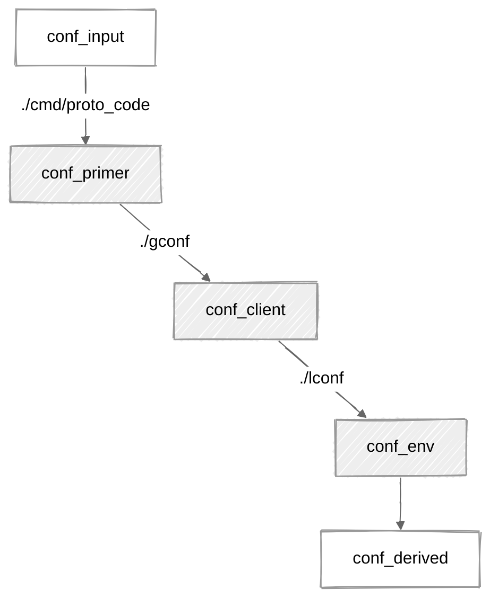

[](https://pypi.org/project/protoprimer)
[](https://github.com/uvsmtid/protoprimer/actions/workflows/test_3.7.yaml)
[](https://github.com/uvsmtid/protoprimer/actions/workflows/test_3.14.yaml)
[](https://github.com/uvsmtid/protoprimer/actions/workflows/lint.yaml)
[](https://github.com/uvsmtid/protoprimer/actions/workflows/doc.yaml)
[](https://coveralls.io/github/uvsmtid/protoprimer)
<!--
FT_84_11_73_28: see supported python versions above.

TODO: Use links to FC/UC docs under `./doc` (when ready) from this readme to navigate to details.
-->

# `protoprimer`

Want (dev) users to run software from your `git` repo after a single arg-less command?

```sh
./prime
```

`protoprimer` is a copy-able environment bootstrap script for any `git` repo avoiding fragile `shell` scripts.

<!--

TODO: Put it somewhere:

This project implements a copy-able init script (to be hosted by other `git` repos) enabling:
*   **`env_bootrapper`** for `python` projects in a **single click** (from fresh repo clone)
*   **`app_starter`** to launch `some_main` function under required `python` version in an isolated `venv`

-->

<a id="protoprimer-motivation"></a>

## Intro: why avoid `shell`?

One reason:\
Your company does **not** test `shell`-scripts.

Not convinced?

<details>
<summary>This list can be **extended**:</summary>

*   :x: non-testable (test code for `shell`-scripts is close to none)
*   :x: no error detection by default (forget `set -e` in one script and false success spreads to others)
*   :x: cryptic "write-only" syntax (e.g. `echo "${file_path##*/}"` vs `os.path.basename(file_path)`)
*   :x: subtle error-prone pitfalls (e.g. `shopt`-modified behavior)
*   :x: unpredictable local/user overrides (e.g. `PATH` points to unexpected binaries, etc.)
*   :x: less cross-platform than it seems even on *nixes (e.g. different command behaviors: macOS vs Linux)
*   :x: no stack traces on failure (encourages excessive logging)
*   :x: limited native data structures (no nested ones)
*   :x: no modularity (code larger than one-page-one-file is cumbersome)
*   :x: no external libraries/packages
*   :x: let one `shell`-script grow, and it is hard to stop (applies to many languages – so, choose wisely)
*   :x: slow
*   ...

</details>

In short, `shell` is a very poor choice of language for evolving software.

Now, let's imagine: people dropped `shell` and picked `python` to automate...

### Problem: one does not simply avoid `shell`

Every time some `repo.git` is cloned,
it has to be prepared/bootstrapped/primed to make many things ready.

Because `python` is **not** ready yet,\
people resort to `shell`-scripts (again!) to make it ready.

<div style="text-align:center;">
    <a href="https://www.youtube.com/shorts/gNYgeAxCK3M">
        
    </a>
</div>

Ultimately, why not use `python` to take care of itself?

### Solution: immediately runnable `python`

Eliminate dependency on `shell`:\
➖ instead of relying on the presence of a `shell` executable to bootstrap `python`\
➕ rely on a `python` executable (of any version) to bootstrap the required `python` version

See the difference:



### Outcome: trivial outside, necessary inside

`protoprimer` wraps the details into a **single-touch**, self-contained, no-deps, no-args, cross-platform, ...\
command started by an **arbitrary** `python` version to bootstrap the required state without user confusion:

```sh
./prime
```

Under the hood, `protoprimer` handles the non-trivial steps
until the control is passed to the client code
which customizes and completes the bootstrap process for any target environment:
*   dev or prod
*   local or cloud
*   Alice or Bob
*   ...

<a id="protoprimer-alternatives"></a>

## Alternatives

The most direct alternative is [`pyapp`][pyapp_project] - unlike that:
*   `protoprimer` does not build a binary, it stays text copy (`python` code) helper within a repo
*   `protoprimer` supports multiple apps launched via entry scripts in the same isolated `venv`
*   `protoprimer` explicitly separates (slower) `env_bootstrapper` and (faster) `app_starter` use cases

Ultimately, `protoprimer` delegates to (rather than replaces) standard tools wrapping unnecessary invocation details.

### Why not `uv`?

Yes, `protoprimer` relies on `uv`.\
Yet, it runs `python` first.

<details>
<summary>details</summary>

Relying on `python` first:
*   is more robust for the **single-touch** bootstrap (`python` is more ubiquitous than `uv`)
*   uses **easily modifiable** local _interpreted_ `python` code to wrap calls to any _compiled_ binary (like `uv`)

In short, `uv` is one of many other executables (external to `python`) employable for bootstrapping.

Also, `uv` is hardly **single-touch** without a wrapper:
*   Its binary has to be prepared. How? A wrapper.
*   Its args have to be provided. How? A wrapper.
*   Full bootstrap requires a few `uv` invocations. How? A wrapper.
*   Users want these details hidden. How? A wrapper.

It is **not** ideal to re-invent such wrappers for every project.

</details>

<a id="protoprimer-getting-started"></a>

## Quick start

For the trivial case, see [instant_python_bootstrap][instant_python_bootstrap].

The single script [`proto_kernel.py`][local_proto_kernel.py] to host in the client repo is called "proto code":



*   Copy (one time):

    Commit your **own copy** next to `pyproject.toml`:

    ```
    ./
    ├── proto_kernel.py    <--- own copy
    ├── pyproject.toml
    └── *
    ```

*   Run (any time):

    ```sh
    ./proto_kernel.py
    ```

*   Use an **entry script** (wrapper) to launch `some_main` function:

    ```py
    # ./some_script.py
    # ...
    proto_kernel.app_starter("some_module:some_main")
    ```

    ```sh
    ./some_script.py
    ```

    This entry script is run by whatever `python` version is searchible in the `PATH`,\
    but `some_main` function is executed by the required `python` version from the isolated `venv`.

## What are "proto code" and "entry scripts"?

*   **"proto code"** is the own copy of [`proto_kernel.py`][local_proto_kernel.py] to be hosted.

*   **"entry scripts"** are those files which rely on "proto code" to switch to `venv`.

<details>
<summary>details</summary>

This is **necessarily confusing**:
*   The actual file name for "proto code" can be almost anything.
*   Name `proto_kernel.py` is the default.
*   It is a **copy** of `protoprimer.primer_kernel` module.
*   So, all three ("proto code", `proto_kernel.py`, `primer_kernel`) are nearly the same thing, but different:
    *   "proto code" is conceptual (always the same name)
    *   `proto_kernel.py` depends on the host repo choice (not always the same)
    *   `primer_kernel` is intentionally different from `proto_kernel.py` (to avoid confusing imports)

Only a **single** "proto code" copy is needed per repo to be used by all "entry scripts".

The own copy for this repo is stored in path:

```sh
./cmd/proto_code/proto_kernel.py
```

With some config, the copy can be moved (under any directory, under any name).

Although it is possible to run the copy directly, it is more flexible to use entry scripts (wrappers):

*   Entry script [`./prime`][local_prime] relies on `env_bootstrapper` function (to prepare the `venv`).

*   Entry scripts in [`./cmd`][cmd_dir] dir mostly rely on `app_starter` function (to start code from the `venv`).

</details>

## Typical usage

Bootstrap (default env):

```sh
./prime
```

Bootstrap (special env):

```sh
./prime --env dst/special_env
```

Upgrade: re-create venv, re-solve and re-install deps, re-pin versions:

```sh
./prime upgrade
```

Review effective config:

```sh
./prime config
```

Bootstrap into an interactive `shell` with activated `venv`:

```sh
./cmd/venv_shell
```

See how `env_bootstrapper` works via this entry script:

```py
# ./cmd/env_bootstrapper:
# ...
proto_kernel.env_bootstrapper("local_doc.cmd_env_bootstrapper:custom_main")
```

See how `app_starter` works via this entry script:

```py
# ./cmd/app_starter:
# ...
proto_kernel.app_starter("local_doc.cmd_app_starter:custom_main")
```

<!--

TODO: Put it somewhere

`protoprimer` targets `python` as the alternative:
*   `python` occupies almost the equivalent niche (as `shell`) for scripting
*   `python` maintains vast mind share (as `shell`)

-->

<!--

TODO: Put it somewhere: or is it already obvious?

## Why `proto*`?

`proto` = early, when nothing exists yet.

`protoprimer` design aims to survive with **minimal pre-conditions**:

*   no pre-installed dependencies
*   no pre-initialized `venv`
*   no required `python` version in `PATH`
*   no special shell config
*   no user CLI args to guess (by default)
*   ...
*   just naked `python` (relatively omnipresent) + [a stand-alone copy][FT_90_65_67_62.proto_code.md] of `protoprimer`.

-->

<!--

TODO: Put it somewhere: or is it unnecessary?

## What are the primary features?

The single primary feature is handling the set of early bootstrap steps:
*   running under **the inconvenient conditions**
*   being **very boring** to re-invent

<details>
<summary>details</summary>

Those early bootstrap steps:
*   distinguish (A) global repo-wide and (B) local environment-specific configuration
*   office-friendly: supporting limited permissions, mirrors for package indexes, proxies, etc.
*   respect flexible repo filesystem layouts - from min to max (choices made by the target client repo)
*   init `venv`, install the necessary dependencies, pin package versions
*   switch initial arbitrary OS-picked `python` binary from the `PATH` to the required version
*   propagate param overrides: config fields - env vars - CLI args
*   delegate to client-specific modules to do the rest\
    (**to run more interesting stuff**)

</details>

This mono repo is roughly divided into:
*   **hard**: **pre**-`venv` runtime is the scope of `protoprimer` (the main focus)
*   **easy**: **post**-`venv` runtime is the scope of `neoprimer` (useful but not essential)

-->

<a id="protoprimer-effective-config"></a>

## Effective configuration

It is possible to generate effective config to see:
*   the data **loaded** from files
*   the data **derived** from the **loaded** data

```sh
./prime config
```

The output uses dynamically generated annotations to explain the purpose of each field.

## Configuration: global vs local

`protoprimer` supports:
*   `gconf` ~ global config: shared between all environments (repo clones)
*   `lconf` ~ local config: private to specific environments (repo clones)



For example, this repo has:

| sample paths                | track changes |                                                          |
|-----------------------------|---------------|----------------------------------------------------------|
| `gconf/*`                   | yes           | dir with global config                                   |
| `lconf -> dst/default_env/` | **no**        | dir with selected local config (symlink to specific env) |
| `dst/*/*`                   | yes           | config dirs for different envs (`lconf` symlink targets) |

To bootstrap in any other (non-default) env, run:

```sh
./prime --env dst/special_env
```

The existence of `lconf` symlink (and where it points to)
is private to the repo clone (and should be `.gitignore`-ed)
but all its possible targets in `dst/*` have to be versioned.

## Filesystem layout: configuration leaps

`protoprimer` supports any filesystem layout for client repos.

To discover the config files within the filesystem, it uses the concept of "config leap" - see:

```
./prime config
```



*   `leap_input`: not a file - represents data available to the process (env vars, CLI args, etc.)
*   [`leap_primer`][leap_primer]: allows "proto code" to find the client repo "global config"
*   [`leap_client`][leap_client]: provides "global config" and allows finding the target env "local config"
*   [`leap_env`][leap_env]: provides "local config"
*   `leap_derived`: not a file - represents effective config data derived from all the other data

## Required `python`: switching executables

The stand-alone "proto code" is designed to be run by any `python` executable (available in `PATH`).

Eventually, based on the target client repo requirements, it must become:
*   specific `python` version
*   executed from the initialized `venv` (with all dependencies)

To achieve this, `protoprimer` switches `python` executables in a multi-staged bootstrap sequence:

```sh
./prime -v
```

Each executable is replaced with `os.execve` call.

<!--
TODO: To support Windows, `os.execve` will have to be changed to use `subprocess` with a chain of children.
-->

## Reproducible `venv`: version pinning

<!--
TODO: Explain that it is delegated to tools lie `pip` or `uv`.
-->

To make bootstrap reproducible for any target env, `protoprimer` supports version pinning (locking):
*   the actual dependencies are specified in the individual [pyproject.toml][pyproject.toml] per project
*   the versions are constrained by [constraints.txt][constraints.txt] managed for selected env (for "local config")

In short:
*   `pyproject.toml` lists the dependencies (and version ranges)
*   `constraints.txt` pins the dependencies to specific versions

<a id="protoprimer-upgrade-project"></a>

## Upgrading versions

To re-create `venv`, re-install the deps, and re-pin the versions, run:

```sh
./prime upgrade
```

To control the dependency versions, spec them inside the [pyproject.toml][pyproject.toml] files.

<!--
TODO: UC_52_87_82_92.conditional_auto_update.md: update when disabling auto-update is possible.
-->

<!--

TODO: Combine this section with "proto code" and "entry scripts".

## Delegation to client code

The bootstrap uses an extensible [DAG][DAG_wiki] to reach a specific state with all its dependencies.

For example,\
[`./prime`][local_prime] (a trivial proxy) relies on\
[`proto_kernel.py`][local_proto_kernel.py] (a local stand-alone copy)\
which:
*   first, bootstraps the environment via itself (outside `venv`),
*   then, continues to bootstrap it via `protoprimer.primer_kernel` (inside `venv`)
*   auto-updates the copy within the client repo (to be available on repo clone)
*   eventually passes control back to trigger additional client-specific steps

-->

<!--

## How to extend and customize it?

TODO: FT_93_57_03_75.app_vs_lib.md: Explain examples `./cmd/env_bootstrapper` and `./cmd/app_starter`

-->

<!--

TODO: Remove the section in this form. Add a section about support for monorepos.

## This repo directory structure: monorepo with related projects

Each subdirectory of [`./src`][src_dir] directory contains related sub-projects (with `pyproject.toml` files):
*   [protoprimer][protoprimer] addresses running `python` code before `venv` is fully configured
*   [neoprimer][neoprimer] contains extensions with code useful to run after `venv` is fully configured
*   non-releasable for this repo:
    *   [local_repo][local_repo] support scripts
    *   [local_test][local_test] test-related helpers
    *   [local_doc][local_doc] documentation-related helpers

-->

---

[readme.md]: readme.md

[pyapp_project]: https://github.com/ofek/pyapp

[local_proto_kernel.py]: cmd/proto_code/proto_kernel.py
[local_primer_kernel.py]: src/protoprimer/main/protoprimer/primer_kernel.py

[local_prime]: prime

[local_doc]: src/local_doc
[local_repo]: src/local_repo
[local_test]: src/local_test
[protoprimer]: src/protoprimer
[neoprimer]: src/neoprimer

[src_dir]: src
[cmd_dir]: cmd

[FT_90_65_67_62.proto_code.md]: doc/feature_topic/FT_90_65_67_62.proto_code.md
[FT_75_87_82_46.entry_script.md]: doc/feature_topic/FT_75_87_82_46.entry_script.md
[SOLID_wiki]: https://en.wikipedia.org/wiki/SOLID
[DAG_wiki]: https://en.wikipedia.org/wiki/Directed_acyclic_graph
[make_wiki]: https://en.wikipedia.org/wiki/Make_(software)
[systemd_wiki]: https://en.wikipedia.org/wiki/Systemd
[FT_57_87_94_94.bootstrap_process.md]: doc/feature_topic/FT_57_87_94_94.bootstrap_process.md

[leap_primer]: cmd/proto_code/proto_kernel.json
[leap_client]: gconf/proto_kernel.json
[leap_env]: dst/default_env/proto_kernel.json

[constraints.txt]: dst/default_env/constraints.txt
[pyproject.toml]: src/neoprimer/pyproject.toml

[protoprimer_alternatives]: #protoprimer-alternatives
[getting_started]: #protoprimer-getting-started
[protoprimer_motivation]: #protoprimer-motivation
[effective_config]: #protoprimer-effective-config
[subsequent_upgrade]: #protoprimer-upgrade-project

[instant_python_bootstrap]: https://github.com/uvsmtid/instant_python_bootstrap
